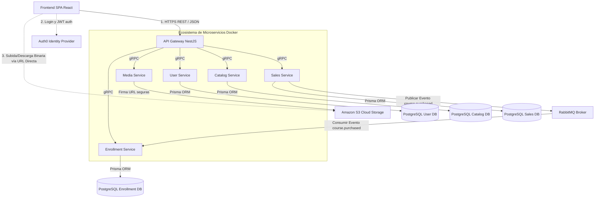

# Udemy Clone - Diseño Técnico

**ESTADO DEL DOCUMENTO:** REVISADO

---

## Resumen Ejecutivo

El proyecto "Udemy Clone" es una plataforma avanzada de e-learning diseñada e implementada bajo una arquitectura de microservicios orientada a eventos. El sistema permite a los instructores crear cursos, estructurarlos en módulos y subir lecciones de video. Por su parte, los estudiantes pueden explorar el catálogo interactivo, realizar compras de cursos y mantener un seguimiento detallado de su progreso de aprendizaje.

Esta arquitectura fue seleccionada para garantizar alta disponibilidad, tolerancia a fallos, y escalabilidad independiente de cada dominio del negocio. El ecosistema se apoya fuertemente en **gRPC** para la comunicación síncrona de baja latencia entre servicios internos, y en **RabbitMQ** como broker de mensajería para la coreografía de eventos asíncronos (como el procesamiento de compras e inscripciones). 

Para el almacenamiento y entrega de contenido multimedia estático, se integra de forma directa con **Amazon S3** mediante el patrón de URLs Prefirmadas, lo que libera a los servidores backend de la pesada carga de procesar flujos de video binarios. La autenticación y seguridad centralizada se delegan en **Auth0** a través de tokens JWT, asegurando que el diseño cumpla con estándares de seguridad modernos de la industria. El despliegue de producción está concebido para entornos de orquestación de contenedores (Docker/Kubernetes) y la nube de AWS EKS.

---

## 1. Requerimientos

### 1.1 Requerimientos Funcionales

1. **Gestión de Cursos (Instructores):** Los usuarios con rol de instructor deben poder crear nuevos cursos, definir el título, descripción y precio, organizar el contenido jerárquicamente (Curso -> Módulos -> Lecciones) y adjuntar una imagen de portada.
2. **Carga y Entrega de Video:** Los instructores deben poder subir videos para cada lección de forma segura y directa a la nube. Los estudiantes deben poder reproducir los videos de los cursos que han adquirido sin latencia o cortes.
3. **Catálogo y Búsqueda (Estudiantes):** Los usuarios (autenticados o anónimos limitados) deben poder explorar la oferta educativa disponible en la plataforma visualizando detalles y precios.
4. **Proceso de Compra (Checkout):** Un estudiante debe poder seleccionar un curso y efectuar una simulación de compra que registre la transacción de manera inmutable.
5. **Matriculación Automática:** Al concretarse una compra, el sistema debe inscribir al estudiante al curso de manera asíncrona pero rápida, otorgándole acceso al material protegido.
6. **Seguimiento de Progreso:** El sistema debe registrar qué lecciones han sido completadas por el estudiante y calcular el porcentaje de progreso global del curso.

### 1.2 Requerimientos No Funcionales

1. **Alta Disponibilidad y Tolerancia a Fallos:** La falla de un servicio de lectura (ej. Catálogo) no debe afectar críticamente a los servicios de transacción o escritura (ej. Ventas).
2. **Eficiencia de Red para Medios Pesados:** La transferencia de archivos de video pesados no debe transitar a través del API Gateway o la red interna de microservicios; el sistema operará con enlaces directos seguros y temporales a S3.
3. **Seguridad y Aislamiento de Datos:** La arquitectura debe implementar el patrón *Database-per-service*. Cada microservicio poseerá su propio motor o base de datos lógica exclusiva, evitando interbloqueos y acoplamiento temporal de esquemas.
4. **Validación de Identidad Stateless:** La seguridad y verificación de sesiones de usuario debe realizarse sin consultar constantemente a una base de datos central. Se usa la validación de firmas de tokens JWT almacenando en caché pública (JWKS).
5. **Comunicación Interna de Baja Latencia:** Para reducir la latencia de red en la arquitectura distribuida, la intercomunicación del backend no usa JSON sobre HTTP/1.1 (REST), sino Protocol Buffers sobre HTTP/2 (gRPC).

---

## 2. Arquitectura del Sistema: Diseño de Alto Nivel

### 2.1 Visión General de Componentes y Docker

El sistema se levanta íntegramente utilizando contenedores de **Docker**. Durante el desarrollo local, un archivo `docker-compose.yml` orquesta la inicialización coordinada de múltiples bases de datos, brokers de mensajería (RabbitMQ) y el resto del backend. Cada microservicio encapsula su propia lógica de dominio y depende exclusivamente de sus propios recursos de base de datos de forma contenida.

El siguiente diagrama ilustra cómo el API Gateway orquesta las peticiones del cliente (Frontend en React) y las traduce a llamadas gRPC de alta eficiencia hacia la red interna de microservicios.



### 2.2 Descripción Detallada de Microservicios

1. **API Gateway (`api-gateway`):**
   - Sirve como la única "puerta delantera" expuesta a internet.
   - Se encarga de recibir peticiones HTTP/REST, interceptar llamadas, validar los tokens JWT proporcionados por Auth0, y enrutar el tráfico de red de forma inteligente hacia el microservicio interno correspondiente traduciéndolo a clientes gRPC. Actúa como proxy inverso y compositor (API Composition).
2. **User Service (`user-service`):**
   - Mantiene los metadatos y preferencias de los perfiles de usuarios registrados. Coordina y almacena internamente los roles (ej. identificando Estudiantes vs Instructores) para cruzar datos, complementando la parte de identidad rígida manejada externamente por Auth0.
3. **Catalog Service (`catalog-service`):**
   - El corazón estructural del contenido de aprendizaje. Gestiona la lógica de negocios detrás de la creación de cursos, configuraciones de precios, currículum formativo (módulos, jerarquías de lecciones), descripciones completas y estados de publicación para ser listados públicamente.
4. **Media Service (`media-service`):**
   - Especializado puramente en la gestión segura del material estático y audiovisual. En lugar de procesar flujos de bytes que saturarían el backend, este servicio se conecta a la API Cloud (AWS) para pedir y devolver "URLs temporales prefirmadas" a los clientes frontends, para que suban videos de múltiples gigabytes directamente al clúster AWS S3.
5. **Sales Service (`sales-service`):**
   - Encapsula estrictamente el dominio de carritos de compras, cálculo de precios y transacciones ("checkout"). Su máxima prioridad es la consistencia transaccional. Guarda la venta inmutablemente en base de datos e informa al sistema asíncronamente emitiendo el evento "alguien acaba de comprar" en las colas de RabbitMQ.
6. **Enrollment Service (`enrollment-service`):**
   - Escucha reactivamente de fondo a RabbitMQ esperando eventos de nuevas compras en su propia cola. Cuando un estudiante efectúa un pago exitoso, este servicio abstrae la creación del registro oficial de inscripción que permite el acceso perpetuo al contenido del curso e implementa los controladores REST/gRPC que registran y leen el progreso porcentual del estudiante.

---

## 3. Inmersiones Profundas (Deep Dives Técnicos)

### 3.1 Seguridad, Autenticación y Autorización de Microservicios

El proyecto adopta una arquitectura de seguridad descentralizada que delega toda la criptografía asimétrica pesada a **Auth0**, un servicio global (IDaaS).

**Flujo de Autenticación (`auth`):**
1. Un cliente se autentica nativamente a través del dashboard modal provisto por Auth0.
2. Auth0 retorna al Fronted SPA de React un JSON Web Token (JWT) válido por corto tiempo firmado asimétricamente.
3. El Frontend integra este JWT dentro del encabezado nativo HTTP (`Authorization: Bearer <token>`) de cada solicitud AJAX enviada al Backend.
4. El **API Gateway** implementa middlewares/guards globales de autenticación. Utiliza la estrategia `passport-jwt` cruzada con la clave pública de Auth0 extraída de la caché JWKS. Verifica matemáticamente que la firma JWT sea inviolable, válida y sin expirar sin ir jamás a una base de datos.
5. Si el token es limpio y legal, el Gateway decodifica la información del cuerpo y extrae campos vitales (ej. el identificador del usuario UUID `sub` y atributos personalizados como `roles`).
6. El Gateway adjunta discretamente esta confianza y variables directamente en la "metadata" (Headers) del llamado binario gRPC antes de despacharlo a la red privada interna (VPC).
7. **Diseño Crítico Zero-Trust Mixto:** Los microservicios operan asumiendo confianza delegada hacia el Gateway. No deben llamar a Auth0 externamente cada vez que validan al usuario, ya extraen el ID de usuario desde la cabecera confiable del Gateway.

### 3.2 Persistencia de Base de Datos y Prisma ORM

Para respetar el verdadero paradigma de microservicios e impedir interbloqueos futuros ("God tables"), la persistencia aplica el principio de **Database-per-service**. En la actual instancia Docker se orquesta una enorme base de datos PostgreSQL pero particionada forzosamente a través de esquemas o conectores separados lógicamente (`user_db`, `catalog_db`, `sales_db`, `enrollment_db`).

**Principios de Manejo de Datos:**
- **ORM Prisma Configurado Aislado:** Todos los dominios y proyectos backend utilizan Prisma Object Relational Mapper de TypeScript. Cada uno tiene de manera individualizada un archivo `schema.prisma` que representa la única fuente de la verdad para su base específica.
- **Acoplamiento Nulo:** Está terminantemente prohibido utilizar "Foreign Keys" relacionales SQL reales entre bases de datos separadas. Por ejemplo, la base de datos de `Enrollment Service` mantiene una tabla que registra referencias de `courseId` en texto plano (UUID), sin imponer ni saber una restricción foránea estricta a nivel SQL sobre la tabla `Courses` alojada en una máquina de base de datos distinta en `Catalog`.
- **Migraciones Automáticas y CI:** Las actualizaciones de modelado en base de datos (DDL) se ejecutan mediante scripts atómicos localizados `npx prisma migrate deploy` exclusivos a la vida de cada contenedor Docker.

### 3.3 Coreografía y Tolerancia a Fallos con RabbitMQ

Implementar una venta que hable directamente y sincrónicamente al sistema de inscripciones (Sales -> Enrollments HTTP/gRPC delay) introduce riesgo, acoplamiento severo y problemas de timeout si las bases de datos fallan momentáneamente. Esta arquitectura migra el flujo a la Arquitectura Basada en Eventos (EDA).

**Estrategia de Flujo Resiliente:**
1. El estudiante paga en el API, el `Sales Service` orquesta la venta, guarda rígidamente en SQL la transacción terminada de pago (`sales_db`) y envía una confirmación HTTP visual ("Pago Completado") instantánea al cliente Frontend. 
2. Internamente y tras bastidores, ese mismo servicio envía o transmite un pequeño mensaje estructurado de RabbitMQ al canal o tópico general `course_purchased_queue` con el `userId` y `courseId`.
3. El `Enrollment Service` que actúa como worker de procesos en background (Consumidor), recolecta este mensaje flotante en su momento cuando pueda procesarlo, inscribe al alumno en la base de datos de `enrollment_db` permitiéndole abrir sus videos en milisegundos. Si Enrollment Database se apagó o reinició, el mensaje de matricula no se pierde jamás. RabbitMQ re-entregará agresivamente el mensaje cuando vuelva en línea asegurando Consistencia Eventual absoluta de datos.

### 3.4 Despliegue en la Nube (Arquitectura y AWS)

Para la fase de producción, este esquema contenerizado bajo Docker y Docker Compose mapea directamente a herramientas Cloud Native distribuidas sobre **AWS**:
- **Cómputo Flexible (Amazon EKS):** Clústeres maestros gestionados de Kubernetes (`kubectl`) que auto-escalan microservicios basándose en CPU, configurando réplicas de los contenedores de NestJS.
- **Frontend SPA Edge (CloudFront/S3):** Código estático de Vite/React no requiere instancias de máquina EC2; es almacenado crudo en buckets S3 y amplificado de borde por red CDN Amazon CloudFront a bajísima latencia mundial.
- **Datos Multi-AZ (Amazon RDS):** Postgres levantado de modo administrado replicándose sincrónicamente en múltiples zonas (Availability Zones) para lograr respaldos de punto en tiempo y conmutación automática de red contra apagones masivos de servidor.
- **Almacenamiento Seguro Privado de Media (S3):** Para reemplazar el LocalStack transitorio, se vinculan buckets S3 autenticados limitando accesos y protegiendo la piratería de videos del sistema.

---

## 4. Estructura de Endpoints de Integración

### 4.1 Accesos REST (Interfaces Externas al Cliente SPA)

La capa que expone el Gateway opera como un RESTful estándar usando JSON para que React lo asimile nativamente por fetch/axios.

```text
-- Authentication Gateway Layer --
POST /users/register                 - Vinculación primera de roles/perfiles en Auth0 a la DB Interna User.

-- Catalog Interaction Layer --
GET  /catalog/courses                - Exposición paginada de todos los cursos comerciales públicos.
POST /catalog/courses                - Orquestación de creación, módulos (Auth + Middleware Instructor Role).

-- Storage Media Access Layer --
GET  /media/upload-url               - Solicitud de obtención de URLs presigned para bucket de video directo.

-- Transaccional Layer --
POST /sales/checkout                 - Endpoint para recibir intención de pago (Simulado/Carrito). Gatilla Rabbit.

-- Progress / Enrollment Layer --
GET  /enrollments/my-courses         - Trae todos los cursos activos inyectados en background y porcentaje cursado.
```

### 4.2 Interfaces Internas gRPC y Protobuf (Backbone)

Para las comunicaciones horizontales transparentes de baja latencia inter-backend, `gRPC` sobre Protocolo de control HTTP/2 compila los modelos centralizados. 

```protobuf
syntax = "proto3";

package catalog;

service CatalogService {
  rpc CreateCourse (CreateCourseRequest) returns (CourseResponse);
  rpc GetCourses (GetCoursesRequest) returns (CourseListResponse);
}

// Representación estricta de estructura y bitpacking
message CreateCourseRequest {
  string title = 1;
  string description = 2;
  double price = 3;
  string instructorId = 4;
}
```

---

## 5. Decisiones Claves de Arquitectura de Ecosistema

### Toma de Decisión A: ¿gRPC vs API REST Internas (JSON HTTP)?

*   **Opción A1:** Seguir utilizando controladores comunes NestJS Express de JSON HTTP con llamadas Axios desde el API Gateway a cada microservicio. (REST Tradicional).
*   **Opción A2 [Decisión Implementada]:** gRPC sobre HTTP/2 compilando Proto Buffers centralmente en la carpeta `grpc-contracts/`.

**Justificación:** La decisión recayó sobre la Opción A2 (gRPC) por el fenomenal rendimiento y la protección estricta. NestJS automatiza el consumo de paquetes binarios serializados con protoc. A pesar de una pequeña fricción para testearlos en Postman a diferencia del REST (que es simple texto legible), la capacidad de enviar tipos fuertemente tipados generados en Typescript a un microservicio sin tener errores de variables JSON que puedan corromper datos internos o hacer caer la aplicación por excepciones silenciosas de variables no nulas compensa ampliamente su implementación.

### Toma de Decisión B: Base de Datos Monolítica Múltiple versus Independiente y Segregada.

*   **Opción B1:** Tener un único `schema.prisma` gigantesco compartido para que todos los contenedores Docker apunten a una enorme base central PostgreSQL y hacer relaciones relacionales `JOIN` en consultas complejas (Monolito SQL).
*   **Opción B2 [Decisión Implementada]:** Database-Per-Service donde ni siquiera pueden compartir la misma string de esquema y carecen de constraints SQL físicos.

**Justificación:** El arquitecto seleccionó Database-Per-Service. En arquitecturas escalables, permitir que el equipo mantenedor de Ventas (`Sales`) modifique la tabla "Payments" y eso detenga de golpe al equipo mantenedor de Cursos que hacia `JOIN` accidental en esa base interconectada es inaceptable. El Gateway hace un patrón clásico de `API COMPOSITION`, trayendo los datos de Catálogo y, en memoria temporal de RAM local del gateway, une esa información con los autores (Users) y retorna un único y bello JSON estructurado masivo a la UI de React.

---

## Interesados y Revisiones

- Equipo Docente, Evaluador de Proyecto de Grado / Maestría en la Nube.
- Evaluadores DevOps (Arquitectura escalable en Kubernetes, Docker e integraciones de flujos de asincronía asimétrica).

## Responsable
- **Líder Técnico de Software / Investigador Académico:** GaboMV
