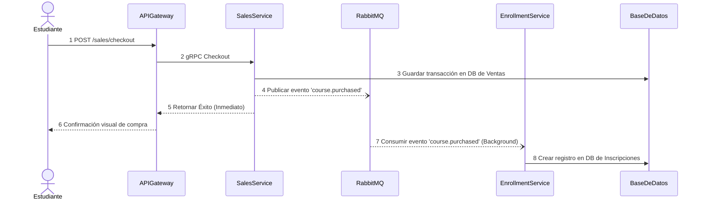
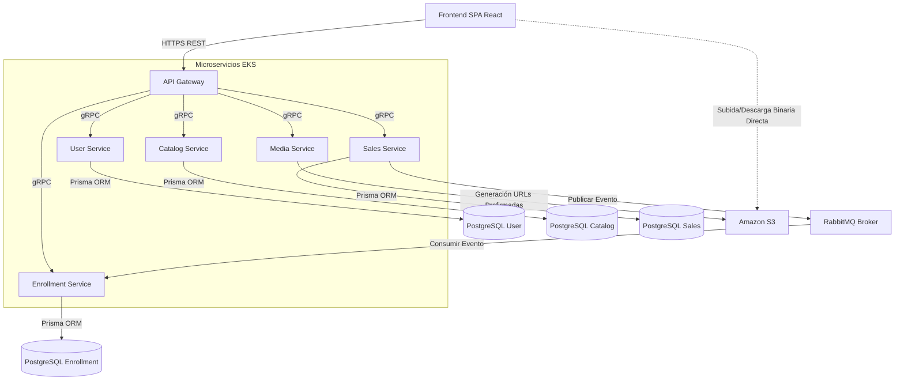

# Udemy Clone - Diseño Técnico

**ESTADO DEL DOCUMENTO:** REVISADO

---

## Resumen

El proyecto "Udemy Clone" es una plataforma de aprendizaje en línea (e-learning) diseñada bajo una arquitectura de microservicios orientada a eventos. Su objetivo es permitir a los instructores crear y publicar cursos con contenido multimedia (videos), y a los estudiantes explorar el catálogo, comprar cursos y realizar un seguimiento de su progreso. 

El sistema utiliza un **API Gateway** como único punto de entrada público, **gRPC** para la comunicación síncrona interna, y **RabbitMQ** para la orquestación asíncrona de inscripciones tras una compra. El almacenamiento multimedia se delega a **Amazon S3** (o MinIO en local), descargando esta responsabilidad de los servidores de aplicación. El despliegue de producción se realiza en Amazon Web Services (AWS).

## Supuestos

- El sistema cuenta con acceso a un proveedor de identidad externo (Auth0) para la gestión de usuarios, login y emisión de JSON Web Tokens (JWT).
- Los clientes (frontend SPA) acceden exclusivamente a través del API Gateway público, la red interna de microservicios no está expuesta a internet.
- Se asume el uso de PostgreSQL como motor de base de datos relacional estándar para todos los servicios que requieran persistencia.

## Alcance y Fases

La **Fase 1** (Entregable Actual) incluye:
- Autenticación y Autorización basada en Roles (Auth0).
- Catálogo de cursos (creación, edición, visualización).
- Gestión de medios (carga de portadas y videos directamente a S3 mediante URLs prefirmadas).
- Flujo de ventas simulado (checkout).
- Inscripción asíncrona mediante broker de mensajería (RabbitMQ).
- Visualización de lecciones y seguimiento de progreso del estudiante.

**Fuera del alcance:**
- Integración con pasarela de pagos real (Stripe/PayPal) para procesar cobros con tarjeta de crédito.
- Generación y emisión automática de certificados en PDF al finalizar el curso.

---

## 1. Requerimientos

### 1.1 Requerimientos Funcionales

1. Los instructores deben poder crear cursos, definir módulos y subir lecciones en formato de video.
2. Los estudiantes deben poder explorar el catálogo de cursos disponibles.
3. Los estudiantes deben poder realizar la compra de un curso de su interés.
4. Tras una compra exitosa, los estudiantes deben ser inscritos automáticamente y obtener acceso inmediato al contenido del curso.
5. Los estudiantes deben poder registrar y visualizar su progreso a lo largo de las lecciones del curso.

### 1.2 Requerimientos No Funcionales

1. El sistema debe ser altamente escalable mediante el desacoplamiento de dominios en microservicios independientes.
2. El sistema debe garantizar consistencia eventual en el flujo de inscripciones, priorizando la alta disponibilidad del servicio de ventas mediante colas de mensajes (Tolerancia a fallos).
3. La carga de archivos multimedia pesados (videos) no debe saturar la red interna de los microservicios ni el API Gateway, operando con URLs prefirmadas (Baja latencia y eficiencia de red).
4. El sistema debe asegurar el aislamiento de datos utilizando el patrón *Database-per-service* para evitar cuellos de botella compartidos en base de datos.
5. La validación de autenticación debe realizarse de manera *stateless* a nivel de API Gateway utilizando caché de JWKS para minimizar la latencia.

### 1.3 Estimación de Capacidad

Dado que el proyecto fue concebido en un ámbito de maestría, el dimensionamiento inicial está pensado para un entorno de demostración con tráfico moderado. Sin embargo, la arquitectura en AWS EKS permite escalar:
- **Lecturas vs Escrituras:** Se espera una alta proporción de lecturas (estudiantes viendo el catálogo y consumiendo lecciones) frente a escrituras (compras o creación de cursos).
- **Almacenamiento:** El uso intensivo de almacenamiento estará focalizado en S3 (videos), por lo que las bases de datos transaccionales (RDS) mantendrán un tamaño manejable (cientos de MBs o pocos GBs).

---

## 2. Entidades Principales

- **User (Usuario):** Representa instructores y estudiantes (atributos básicos y roles de Auth0).
- **Course (Curso):** Metadatos del curso (título, descripción, precio, instructorId, imagen de portada).
- **Module / Lesson (Módulo / Lección):** Estructura jerárquica del contenido de un curso.
- **Media (Recurso Multimedia):** Referencias y metadatos de los objetos almacenados en S3 (videos).
- **Sale (Venta/Transacción):** Registro inmutable de una compra realizada por un estudiante.
- **Enrollment (Inscripción):** Relación que habilita a un estudiante a acceder a un curso comprado y donde se almacena su progreso por lección.

---

## 3. API o Interfaz del Sistema

### APIs Públicas (REST a través del API Gateway)

```text
POST /users/register
GET /catalog/courses
POST /catalog/courses (Requiere Auth y Rol de Instructor)
GET /media/upload-url -> Retorna URL prefirmada de S3 para subida directa.
POST /sales/checkout -> Inicia el flujo de compra.
GET /enrollments/my-courses -> Lista los cursos comprados por el usuario.
```

### APIs Internas (gRPC)
La comunicación interna no utiliza REST, sino Protocol Buffers.
Ejemplo: `catalog.proto` define el servicio `CatalogService` con las llamadas a procedimientos remotos como `CreateCourse`, invocadas de forma transparente por el API Gateway.

---

## 4. Flujo de Datos

**Flujo Asíncrono de Compra e Inscripción**

Este flujo describe cómo la compra de un curso impacta en el servicio de inscripciones de manera asíncrona, protegiendo al usuario de tiempos de espera largos.



---

## 5. Diseño de Alto Nivel

### Componentes

El siguiente diagrama ilustra la arquitectura de componentes. El API Gateway orquesta las llamadas REST del cliente traduciéndolas a gRPC hacia la red de microservicios en las subredes privadas.



---

## 6. Inmersiones Profundas

### 6.1 Esquema de Base de Datos

Se emplea el patrón **Database-per-service**. Para optimizar costos en un entorno de desarrollo/académico, se puede utilizar una única instancia de base de datos (Ej. Amazon RDS), pero aislando completamente los datos a nivel de *esquemas lógicos*. Ningún microservicio tiene credenciales o visibilidad sobre el esquema de otro.

Las migraciones y modelado se realizan de forma declarativa con **Prisma ORM** dentro de cada repositorio individual.

### 6.2 Escalabilidad e Infraestructura

El sistema está diseñado Cloud-Native y se despliega en **AWS**:
- **Cómputo:** Amazon EKS (Kubernetes) con despliegues de Pods por microservicio.
- **Frontend:** Archivos estáticos en Amazon S3 distribuidos globalmente con Amazon CloudFront (CDN).
- **Almacenamiento:** Amazon S3 para todo el material de video e imágenes.
- **Base de Datos:** Amazon RDS Multi-AZ.

### 6.4 Seguridad

- Todo el control de identidad se delega a **Auth0** (estándar OpenID Connect).
- Las llamadas desde el frontend incluyen un JWT.
- El **API Gateway** asume la responsabilidad de descifrar y validar el JWT verificando la firma (RS256) usando el JWKS de Auth0 cacheado en memoria.
- Si la solicitud es válida, el API Gateway extrae el `userId` y `role`, inyectándolos en la metadata de la llamada gRPC, por lo que los microservicios internos no necesitan verificar el token, solo confían en la identidad propagada por el Gateway.

### 6.5 Extensibilidad

Gracias a la segregación en dominios bounded-context, la arquitectura puede extenderse sin fricción. Por ejemplo, si se requiriera un sistema de foros de dudas (`ForumService`) o un sistema de reseñas (`ReviewService`), estos pueden desarrollarse en cualquier lenguaje de programación soportado por gRPC, crear sus propias bases de datos y conectarse al ecosistema sin necesidad de redesplegar los servicios de catálogo o ventas existentes.

### 6.7 Proceso de Lanzamiento

1. El código de cada microservicio incluye un `Dockerfile`.
2. Las imágenes se construyen y suben a un registro de contenedores (e.g., Docker Hub o Amazon ECR).
3. Los manifiestos de Kubernetes alojados en el repositorio `maestria-infra` se aplican (`kubectl apply -f`) al cluster EKS para orquestar los pods, ConfigMaps (variables de entorno) y servicios internos.

### 6.11 Dependencias

- **Auth0**: Como proveedor externo de gestión de identidades y JWT.
- **Amazon S3**: Vital para el funcionamiento de `media-service` y almacenamiento de videos.
- **RabbitMQ**: Obligatorio para garantizar el flujo de matriculación luego de las compras.

---

## Temas de Discusión

### Tema de Discusión: Comunicación Interna entre Microservicios

Para la intercomunicación del ecosistema interno, se requería decidir cómo el API Gateway (y en el futuro otros servicios) se hablarían entre sí.

- Opción 1 [RECOMENDADA] - Uso de **gRPC** (sobre HTTP/2)
- Opción 2 - Uso de **REST HTTP/1.1** tradicional

#### Opción 1 [RECOMENDADA] - gRPC

En este enfoque, se creó un repositorio compartido (`maestria-grpc-contracts`) que contiene archivos `.proto`. Los servicios compilan estos contratos para generar interfaces fuertemente tipadas.

**Pros:**
- Contratos de comunicación estrictos y centralizados. Si el contrato cambia, la compilación falla, previniendo errores en ejecución.
- Rendimiento superior por la serialización binaria (Protobuf) y el uso de multiplexación nativa en HTTP/2.

**Contras:**
- Curva de aprendizaje técnica mayor frente a REST.
- Mayor fricción para depuración manual (Postman/cURL tradicional no sirve directamente sin plugins específicos).

#### Opción 2 - REST HTTP/1.1

En este enfoque, cada microservicio expone endpoints convencionales con cuerpos en formato JSON.

**Pros:**
- Ubicuo, ampliamente conocido y extremadamente fácil de depurar y probar en aislamiento.

**Contras:**
- Mayor latencia debido a la serialización en texto plano (JSON).
- No hay garantía estricta de cumplimiento de contratos entre emisor y receptor si no se configuran herramientas pesadas adicionales como OpenAPI/Swagger a nivel de red interna.

**Conclusión**

Dada la consideración de las opciones, decidimos optar por la **Opción 1 (gRPC)**. En un entorno distribuido, garantizar que el API Gateway envíe exactamente la forma de datos que el Catálogo espera (mediante validación por tipos compilados) reduce significativamente los bugs de integración. Además, compensa la latencia extra introducida al tener la red fragmentada en múltiples servicios.

---

## Interesados

- Equipo Académico y Catedrático evaluador de la maestría.

## Contactos

- **Líder Técnico / Autor:** GaboMV
