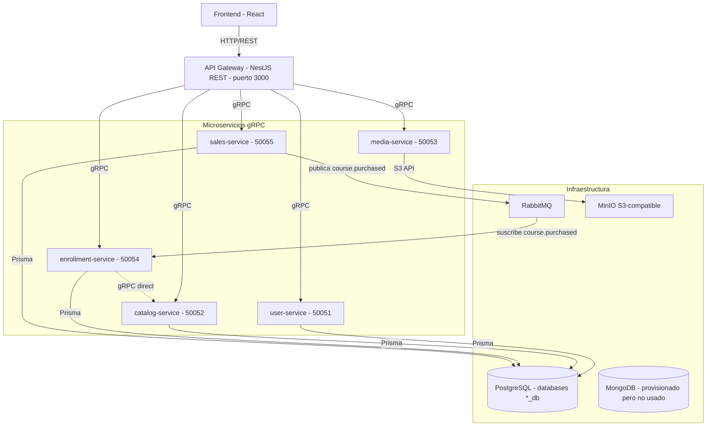

# Estado de Implementación — `maestria-architecture`

> **Documento primario de estado actual / Current State.**
>
> Este archivo describe la realidad verificada del ecosistema de microservicios: puertos, persistencia, flujos, acoplamientos, infraestructura y brechas conocidas. Es la fuente de verdad para entender **qué corre hoy**.
>
> La visión objetivo / target architecture se mantiene en [`TDD_Udemy_Clone_Microservices.md`](./TDD_Udemy_Clone_Microservices.md) con etiqueta `ARQUITECTURA OBJETIVO`. Cualquier patrón que figure allí como aspiración y que aún no esté implementado se señala explícitamente en la sección `Problemas Conocidos` de este documento.

---

## 1. Resumen de Topología

El ecosistema está compuesto por **9 repositorios** coordinados:

| Repositorio | Rol |
|-------------|-----|
| `maestria-architecture` | Documentación y topología (este repositorio). |
| `maestria-grpc-contracts` | Contratos `.proto` compartidos y artefactos TypeScript pre-generados. |
| `maestria-infra` | `docker-compose.yml` con PostgreSQL, MongoDB, RabbitMQ y MinIO. |
| `maestria-api-gateway` | Punto de entrada REST (NestJS). Orquesta llamadas gRPC hacia los servicios. |
| `maestria-user-service` | Perfiles de usuario y roles. |
| `maestria-catalog-service` | Cursos, módulos, lecciones, recursos. |
| `maestria-media-service` | Presigned URLs contra MinIO (S3-compatible). |
| `maestria-enrollment-service` | Inscripciones, progreso y consumo de eventos de compra. |
| `maestria-sales-service` | Cobros simulados y emisión de eventos de compra. |

### 1.1 Mapa de Puertos Verificado

| Servicio | Puerto gRPC | Fuente verificada |
|----------|-------------|-------------------|
| `user-service` | `50051` | `maestria-user-service/.env.example:7` |
| `catalog-service` | `50052` | `maestria-catalog-service/.env.example:11` |
| `media-service` | `50053` | `maestria-media-service/.env.example:1` |
| `enrollment-service` | `50054` | `maestria-enrollment-service/.env.example:7` |
| `sales-service` | `50055` | `maestria-sales-service/.env.example:7` |
| API Gateway (REST) | `3000` | `maestria-api-gateway/src/main.ts:23` |
| PostgreSQL (Docker Gateway) | `5434` | `maestria-api-gateway/docker-compose.db.yml:14` |
| PostgreSQL (Docker infra) | `5433` | `maestria-infra/docker-compose.yml:33` |
| RabbitMQ (AMQP / Management) | `5672` / `15672` | `maestria-infra/docker-compose.yml:57-58` |
| MinIO (API / Console) | `9000` / `9001` | `maestria-infra/docker-compose.yml:65-66` |
| MongoDB | `27017` | `maestria-infra/docker-compose.yml:5` |

### 1.2 Vista de Componentes (alto nivel)

> **Notas del diagrama:**
> - El acoplamiento directo `enrollment-service → catalog-service` por gRPC existe en código y se documenta en la sección 4.4.
> - MongoDB está provisionado en `maestria-infra` pero ningún servicio lo consume. Se trata como artefacto muerto (ver `Problemas Conocidos`).
> - `review.proto` existe en `maestria-grpc-contracts`, pero **no hay cliente gRPC de reseñas registrado en el API Gateway** y **no existe el repositorio del servicio de reseñas** (ver `Problemas Conocidos`).

---

## 2. API Gateway (`maestria-api-gateway`)

- **Stack:** NestJS sobre HTTP/REST, con prefijo global `/v1`.
- **Puerto de escucha:** `3000`.
- **Clientes gRPC registrados:** `USER_SERVICE`, `CATALOG_SERVICE`, `MEDIA_SERVICE`, `ENROLLMENT_SERVICE`, `SALES_SERVICE`. **No registra un cliente de reseñas** aunque `maestria-grpc-contracts/review.proto` exista. Esta ausencia se cross-linkea con la sección `Problemas Conocidos`.
- **Autenticación:** Passport JWT con estrategia local. La validación ocurre en el Gateway mediante JWKS contra Auth0 (`jwks-rsa` + `passport-jwt`, algoritmo `RS256`). El payload se decodifica y se inyecta en la request como `userId` y `role`. La interacción con Auth0 **no** es intermediada por `user-service` en el flujo principal: el Gateway es el único punto que conversa con el IdP.
- **Gestión de archivos (multimedia):** el Gateway escribe uploads a disco local en `uploads/` (en la raíz del proceso del Gateway) y expone esos archivos como estáticos bajo `/uploads/`. Esto vuelve al Gateway **stateful por disco**. La "Regla de Oro" del target —el Frontend solo toca Gateway y MinIO— no se cumple en la práctica para videos y portadas; el Frontend recibe URLs que apuntan al propio Gateway.
- **Orquestación de checkout:** el Gateway ejecuta un flujo híbrido: llama a `ProcessPayment` (gRPC) y luego a `EnrollStudent` (gRPC) por cada curso, en paralelo. El detalle del patrón dual-write está en la sección 4.4 y en `Problemas Conocidos`.

---

## 3. Servicios de Dominio

### 3.1 `user-service` (puerto `50051`)

- **Persistencia:** PostgreSQL, accedida vía Prisma. El `schema.prisma` declara `provider = "postgresql"` y dos modelos: `UserProfile` (id, nombre, avatar) y `UserRole` (id, rol por defecto `Student`).
- **Capacidades:** sincronización de perfil y rol desde Auth0, lectura batch de usuarios por id para componer respuestas con datos de instructor.
- **Acoplamiento con Auth0:** declarado en el `TDD` como capacidad central, pero en la realidad el `user-service` no es el punto de interacción con el IdP en el flujo principal. Su RPC `ValidateToken` existe en el contrato pero no se usa en el flujo de requests. La validación real sucede en el Gateway.

### 3.2 `catalog-service` (puerto `50052`)

- **Persistencia:** PostgreSQL, accedida vía Prisma.
- **Capacidades:** cursos, módulos, lecciones, recursos; subida de video, portada y material adjunto; verificación de ownership para autores; consulta batch de cursos por ids; detalles expandidos para el Frontend.
- **Contrato gRPC:** `catalog.proto` declara **trece RPCs** en `CatalogService` (cobertura completa: `CreateCourse`, `AddModuleToCourse`, `AddLessonToModule`, `UpdateLessonVideo`, `GetCoursesByIds`, `GetCourseInfo`, `ListCourses`, `GetCourseDetails`, `UpdateCourse`, `AddResourceToLesson`, `UpdateModule`, `UpdateLesson`, `VerifyOwnership`). Los mensajes `Course`, `Module`, `Lesson`, `ModuleDetails` y `UpdateCourseRequest` ya incluyen campos que la documentación previa omitía (`coverImage`, `description` en `Lesson`, `resources[]`, `position`).
- **Consumidores:** el API Gateway lo invoca desde prácticamente todos los flujos de curso. Adicionalmente, `enrollment-service` lo consume directamente por gRPC para componer datos (ver 4.4).

### 3.3 `media-service` (puerto `50053`)

- **Persistencia:** no almacena estado. Es un servicio *stateless* por estado propio: la fuente de verdad de los objetos es MinIO (S3-compatible).
- **Capacidad principal:** generación de URLs pre-firmadas contra MinIO. Endpoint expuesto por el Gateway: `POST /v1/media/upload-url` que delega al RPC `GeneratePresignedUrl` del servicio.
- **Uso real:** el path de MinIO (presigned URL) está implementado pero aparece como **camino secundario**. La ruta primaria de subida de videos y portadas en el flujo actual es la escritura a disco del Gateway descrita en 2.
- **Acoplamiento hacia el catálogo:** el `media-service` conoce la URL del `catalog-service` por variable de entorno; la subida de un video se cierra cuando el Gateway llama a `UpdateLessonVideo` en el catálogo con la URL final.

### 3.4 `enrollment-service` (puerto `50054`)

- **Persistencia:** PostgreSQL, accedida vía Prisma.
- **Capacidades:** inscripción de estudiante, listado de cursos del estudiante, marcado de lección completada.
- **Acoplamiento directo con el catálogo:** este servicio registra un cliente gRPC hacia `catalog-service` para resolver `GetCourseInfo` (precio en validaciones), `GetCourseDetails` (conteo de lecciones para progreso) y `GetCoursesByIds` (composición de `GetMyCourses`). Este acoplamiento **no aparece en el diagrama de topología de la documentación previa** y se lista como punto a entender en la sección 4.4.
- **Consumo asíncrono:** además del camino síncrono desde el Gateway, escucha el evento `course.purchased` mediante `@EventPattern` y aplica la inscripción con `upsert` para idempotencia frente a entregas duplicadas del broker. La sección 4.4 describe el patrón dual-write que resulta.

### 3.5 `sales-service` (puerto `50055`)

- **Persistencia:** PostgreSQL, accedida vía Prisma.
- **Capacidad:** simulación de pagos con datos de tarjeta. Procesa la petición `ProcessPayment` y publica el evento `course.purchased` en RabbitMQ tras un pago exitoso.
- **Broker:** RabbitMQ, con la cola configurable vía `RABBITMQ_QUEUE` (el `.env.example` de los servicios de venta y enrollment usa `sales_queue`) y la URL `amqp://localhost:5672`. La emisión es **post-confirmación** del pago y constituye una de las dos mitades del dual-write.
- **Limitación documentada:** no existe flujo de compensación publicado en RabbitMQ (no se emite `enrollment.failed` ni se escucha para revertir pagos). El TDD lo lista como objetivo a futuro; la implementación actual **no lo incluye**.

---

## 4. Patrones Transversales

### 4.1 Persistencia

- Toda la persistencia de negocio es **PostgreSQL** (Prisma) para `user-service`, `catalog-service`, `enrollment-service` y `sales-service`.
- El TDD original proponía polyglot persistence con PostgreSQL y MongoDB. **No hay MongoDB usado por ningún servicio**; la base sigue provisionada en `maestria-infra` (puerto `27017`) pero no se conecta desde los servicios.
- Las bases se aprovisionan mediante `maestria-api-gateway/docker/postgres-init/01-create-databases.sql` (cuatro `CREATE DATABASE`: `catalog_db`, `enrollment_db`, `sales_db`, `user_db`).
- El detalle de la divergencia de nombres de base está en la sección 5.2.

### 4.2 Generación de Contratos gRPC

- Los contratos viven en `maestria-grpc-contracts` (`.proto` + carpeta `generated/` con tipos TypeScript pre-generados).
- El `package.json` del repo **no declara dependencias**; el script `npm run generate` referencia una ruta de Windows (`..\\backend-microservices\\review-grpc-service\\node_modules\\.bin\\protoc-gen-ts_proto.cmd`), por lo que no es ejecutable en Linux/macOS sin editar.
- La generación real en uso es un script custom (`generate-ts.js`) que parsea los `.proto` y produce tipos TS. Los artefactos en `generated/` están **versionados** y son los que efectivamente se importan desde los servicios.

### 4.3 Autenticación y Autorización

- **Auth0** es el IdP. La validación ocurre en el Gateway con JWKS. La audiencia y el issuer se leen de variables de entorno y son obligatorios (el `JwtStrategy` falla en arranque si faltan).
- El Gateway extrae `userId` y `role` del payload y los inyecta en `req.user`; el resto de los servicios recibe la identidad por contexto gRPC o por parámetros explícitos, no por re-validación de token.
- El `user-service` conserva un RPC `ValidateToken` declarado en su contrato, pero **no participa en el flujo principal** de validación.

### 4.4 Flujo de Inscripción (patrón dual-write)

La compra culmina en inscripciones a través de **dos caminos concurrentes** que terminan materializando el mismo estado:

1. **Camino síncrono (Gateway → enrollment-service):** el Gateway llama a `ProcessPayment` y, tras respuesta exitosa, llama a `EnrollStudent` por cada curso del carrito en paralelo. Este camino es el que el cliente observa primero.
2. **Camino asíncrono (sales-service → RabbitMQ → enrollment-service):** `sales-service` emite `course.purchased`. `enrollment-service` lo consume con `@EventPattern('course.purchased')` y aplica la inscripción con `upsert`, lo que provee idempotencia ante re-entregas.

**Consecuencia:** una misma inscripción puede materializarse por cualquiera de los dos caminos (o ambos). El estado final es consistente por la idempotencia del `upsert`, pero la latencia, el orden y la observabilidad difieren entre los dos paths.

`enrollment-service` también **consulta directamente a `catalog-service` por gRPC** para resolver datos de curso (precio, detalle, batch de cursos) en su propio flujo de negocio. Este acoplamiento es intencional y necesario hoy para las funcionalidades de validación, progreso y composición.

### 4.5 Subida de Archivos (patrón dual-path)

| Path | Mecanismo | Endpoint en Gateway | Destino físico | Estado |
|------|-----------|---------------------|----------------|--------|
| **A — Local disk (primario hoy)** | `FileInterceptor` + `fs.writeFileSync` en handler del Gateway + montaje de `uploads/` como estático en `main.ts` | `POST /v1/courses/:id/cover`, `POST /v1/lessons/:lessonId/video`, `POST /v1/lessons/:lessonId/resources` | Carpeta `uploads/` en la raíz del proceso del Gateway | En uso; URLs devueltas apuntan a `http://localhost:3000/uploads/...` |
| **B — MinIO presigned (diseñado, secundario)** | Generación de presigned URL contra MinIO vía `media-service` | `POST /v1/media/upload-url` | Bucket `udemy-media` en MinIO | Implementado, sin uso predominante en el flujo actual |

---

## 5. Infraestructura

### 5.1 Componentes

- **PostgreSQL 15** provisionado en Docker, expuesto en `5434` desde `maestria-api-gateway/docker-compose.db.yml` (path usado por los servicios vía `DATABASE_URL`).
- **PostgreSQL 15** provisionado en Docker, expuesto en `5433` desde `maestria-infra/docker-compose.yml` (path **no usado** por los servicios en su `DATABASE_URL`).
- **RabbitMQ 3 (con management UI)** en Docker. Usado por `sales-service` (publica) y `enrollment-service` (consume). El nombre de cola por defecto es `sales_queue`.
- **MinIO** (S3-compatible) en Docker. Bucket pre-creado `udemy-media`. Accesible vía S3 API desde `media-service`.
- **MongoDB** en Docker (`maestria-infra`). Provisionado y arrancado, **sin consumidores** desde los microservicios.

### 5.2 ⚠️ DESVIACION — Convención de nombres de bases de datos

**Convención operativa vigente:** `*_db` (sin prefijo `udemy_`, sin valor por defecto `udemy_db` ni `postgres`).

**Evidencia del path que efectivamente funciona:**

- `maestria-api-gateway/docker/postgres-init/01-create-databases.sql:2-5` crea las cuatro bases: `catalog_db`, `enrollment_db`, `sales_db`, `user_db`.
- Los `.env.example` de los cuatro servicios (`maestria-{user,catalog,enrollment,sales}-service/.env.example`) apuntan a `user_db`, `catalog_db`, `enrollment_db`, `sales_db` respectivamente, sobre el host `localhost:5434`.
- `maestria-api-gateway/docker-compose.db.yml:18` fija `POSTGRES_DB: postgres` **únicamente** como base de administración/mantenimiento del contenedor; el init script aprovisiona las bases de servicio en arranque.

**Sources desalineados** (documentados, no corregidos por este cambio):

| Source | Línea | Valor declarado | Estado |
|--------|-------|-----------------|--------|
| `maestria-infra/docker-compose.yml` | `37` | `POSTGRES_DB: udemy_db` (base única) | No coincide con el path operativo `*_db`; este compose además no es el que usan los servicios (los servicios usan el puerto `5434`, no el `5433` de este compose). |
| `maestria-infra/README.md` | `8` | `udemy_catalog_db`, `udemy_enrollment_db`, `udemy_sales_db` | Naming distinto al operativo. No refleja la convención `*_db` en uso. |
| `maestria-api-gateway/docker-compose.db.yml` | `18` | `POSTGRES_DB: postgres` | Es la base de admin del contenedor; **no** es la base de servicio. El init script provee las reales. |

**Política:** este cambio **no exige ni instruye** edición de archivos de infra, compose o env. La divergencia queda documentada como drift observado. La reconciliación se trata como trabajo futuro de cleanup de infra (cross-link con la sección equivalente en el TDD).

### 5.3 ⚠️ DESVIACION — MongoDB provisionado sin consumidor

- `maestria-infra/docker-compose.yml:1-11` levanta MongoDB en `27017` y `mongo-express` en `8082`.
- Ningún servicio referencia MongoDB en su `prisma/schema.prisma`, en su `app.module.ts` ni en sus variables de entorno.
- El TDD proponía polyglot persistence; el código no la implementa. Se trata como **infraestructura ociosa** a retirar en un cleanup de `maestria-infra`.

---

## 6. Problemas Conocidos / Known Issues

Cada entrada describe el impacto arquitectónico del estado actual. No son tareas con asignaciones; son riesgos a entender antes de tomar decisiones sobre los servicios.

### 6.1 Inscripciones por dual-write sin Outbox transaccional

- **Impacto:** la inscripción se materializa por dos caminos (síncrono desde el Gateway y asíncrono vía RabbitMQ). No existe un patrón Transactional Outbox que asegure entrega atómica del evento tras un commit de la venta, ni un flujo de compensación publicado en el broker para revertir pagos ante fallas de inscripción.
- **Mitigación parcial en uso:** `upsert` en el consumidor de `course.purchased` provee idempotencia ante re-entregas, pero no resuelve el caso de un crash del broker entre el commit del pago y la publicación.
- **Estado:** divergencia respecto a la arquitectura objetivo; el TDD lo lista como explícitamente fuera de alcance.

### 6.2 API Gateway stateful por disco

- **Impacto:** el Gateway escribe uploads (videos, portadas, recursos) a `uploads/` en su propio filesystem y los sirve como estáticos. Esto rompe el patrón stateless típico de un API Gateway y complica el escalado horizontal: una segunda instancia no compartiría los archivos. Cualquier decisión de HA del Gateway debe considerar almacenamiento compartido o refactor hacia MinIO.
- **Estado:** divergencia respecto a la "Regla de Oro" del target.

### 6.3 Subida de archivos con doble path (local + MinIO)

- **Impacto:** coexisten dos mecanismos de subida. La ruta primaria es el disco del Gateway; la ruta MinIO existe pero su uso real es marginal. Esta duplicidad aumenta superficie de mantenimiento y genera ambigüedad sobre cuál es la "correcta" para nuevos casos.
- **Estado:** patrón dual declarado en `Problemas Conocidos` hasta que se decida cuál es el definitivo.

### 6.4 Acoplamiento directo `enrollment-service → catalog-service`

- **Impacto:** `enrollment-service` depende operativamente de la disponibilidad y de la forma de los RPCs `GetCourseInfo`, `GetCourseDetails` y `GetCoursesByIds` del `catalog-service`. Cambios en esos RPCs pueden romper funcionalidad de inscripción, listado de cursos del estudiante o progreso. Este acoplamiento **no** se representa en el diagrama de topología del TDD, por lo que es fácil pasarlo por alto en revisiones.

### 6.5 Servicio de reseñas ausente — gap de capacidad

- **Impacto:** el contrato gRPC `review.proto` existe en `maestria-grpc-contracts` con CRUD completo (`CreateReview`, `GetReview`, `UpdateReview`, `DeleteReview`, `ListCourseReviews`) y los tipos TS pre-generados. Sin embargo:
  - No existe el repositorio `maestria-review-service` en el workspace.
  - El API Gateway **no registra un cliente gRPC de reseñas** en su módulo de clientes.
  - Ningún endpoint REST del Gateway expone operaciones de reseñas.
- **Cross-link al target:** esta capacidad está documentada en el TDD con la etiqueta `OBJETIVO` (servicio planificado, contrato proto parcialmente implementado, sin repositorio de servicio). Ver `TDD_Udemy_Clone_Microservices.md` → sección de contratos y servicios gRPC.

### 6.6 Naming de bases de datos divergente entre sources

- **Impacto:** un nuevo desarrollador que lea `maestria-infra/README.md` o `maestria-infra/docker-compose.yml` esperará nombres `udemy_*_db` / `udemy_db`, pero los servicios usan `*_db` provisto por el init script del API Gateway. Quien intente conectar a `udemy_db` directamente no encontrará las tablas operativas.
- **Mitigación:** seguir siempre la convención `*_db` (catalog_db / enrollment_db / sales_db / user_db) declarada en la sección 5.2. La sección 5.2 lista los sources desalineados.

### 6.7 MongoDB provisionado sin consumidor

- **Impacto:** se levanta un contenedor (y su UI) que ningún servicio consume. Aumenta superficie de ataque, consumo de recursos y confusión sobre si el stack realmente es polyglot. No es un bug funcional, sí es drift de infra.

### 6.8 Toolchain de generación de protos no portable

- **Impacto:** el script `npm run generate` de `maestria-grpc-contracts` referencia una ruta de Windows y un binario `.cmd` que no existen en el árbol real del repo. En la práctica, los tipos TS se generan con un script custom y se commitean pre-generados. Quien intente regenerar en Linux/macOS sin ajustes verá el script fallar.

---

## 7. Lectura Recomendada

1. **Nuevo en el equipo:** leer este documento primero. Cubre puertos, DBs, flujos, infraestructura y brechas verificadas.
2. **Revisión de arquitectura / planeación de capacidad:** leer [`TDD_Udemy_Clone_Microservices.md`](./TDD_Udemy_Clone_Microservices.md) como referencia de la visión objetivo, contrastando contra la sección `Problemas Conocidos` de este archivo para entender el gap actual.
3. **Operación local:** levantar `maestria-api-gateway/docker-compose.db.yml` y `maestria-infra/docker-compose.yml` por separado. Los servicios apuntan a `localhost:5434`; el compose de infra (puerto `5433`) no es el path operativo actual.
