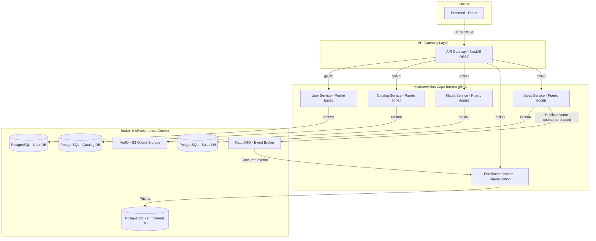

# Informe de Arquitectura

> **Hub central de la arquitectura de la plataforma Udemy Clone.**  
> Este documento describe la arquitectura implementada del ecosistema de microservicios: topología, servicios, comunicación, persistencia, seguridad, contratos e infraestructura de soporte.

---

## 1. Resumen Ejecutivo

La plataforma Udemy Clone es un sistema distribuido construido como un ecosistema de microservicios desplegables de forma independiente. Los usuarios interactúan con el sistema a través de un **API Gateway** que expone endpoints REST, y la comunicación interna entre servicios se realiza con **gRPC** sobre HTTP/2 para minimizar latencia y aprovechar tipado estricto mediante Protocol Buffers. Los procesos asíncronos (notablemente la inscripción tras una compra) se coordinan mediante **RabbitMQ**, y el material multimedia (videos, portadas, recursos) se almacena en **MinIO** con acceso S3-compatible.

La separación de dominios adoptada es la siguiente:

- **api-gateway** — única puerta de entrada para el frontend.
- **user-service** — gestión de perfiles y roles.
- **catalog-service** — cursos, módulos, lecciones y recursos.
- **media-service** — generación de URLs de carga y operación de object storage.
- **enrollment-service** — inscripciones y progreso de los estudiantes.
- **sales-service** — flujo de compra y emisión de eventos.

La persistencia se realiza con **PostgreSQL** mediante **Prisma**, con una base de datos lógica por servicio. La autenticación se delega a **Auth0** y la validación de tokens se ejecuta de forma stateless en el API Gateway mediante JWKS cacheado.

---

## 2. Topología General del Sistema

El siguiente diagrama refleja el estado actual del ecosistema. Cada servicio expone su propio puerto gRPC y la base de datos a la que se conecta es propiedad exclusiva del servicio que la declara.



**Notas de la topología:**

- Cada microservicio escucha en su propio puerto gRPC y no comparte su base de datos con otros.
- El API Gateway es el único punto de contacto entre el frontend y el ecosistema interno.
- Los procesos asíncronos (compra → inscripción) se orquestan con eventos en RabbitMQ.

---

## 3. Servicios y Responsabilidades

### 3.1 `api-gateway`
- **Tipo:** NestJS con transporte HTTP/REST.
- **Responsabilidad:** autenticar cada request contra Auth0 (JWKS en memoria), traducir REST a gRPC, y exponer el endpoint público a la SPA.
- **Puerto:** `3000` (HTTP).
- **Cliente:** la SPA en React.

### 3.2 `user-service`
- **Tipo:** NestJS con transporte gRPC.
- **Responsabilidad:** gestionar perfiles de usuario y roles, manteniendo sincronía con los claims emitidos por Auth0.
- **Puerto:** `50051` (gRPC).
- **Persistencia:** PostgreSQL con Prisma.

### 3.3 `catalog-service`
- **Tipo:** NestJS con transporte gRPC.
- **Responsabilidad:** administrar cursos, módulos, lecciones y recursos. Es la fuente de verdad de la oferta académica.
- **Puerto:** `50052` (gRPC).
- **Persistencia:** PostgreSQL con Prisma.

### 3.4 `media-service`
- **Tipo:** NestJS con transporte gRPC.
- **Responsabilidad:** generar URLs prefirmadas de carga y descarga contra MinIO, y mantener los metadatos de los recursos multimedia en su propia base de datos.
- **Puerto:** `50053` (gRPC).
- **Persistencia:** PostgreSQL con Prisma.
- **Almacenamiento:** MinIO (S3 compatible).

### 3.5 `enrollment-service`
- **Tipo:** NestJS con transporte híbrido (gRPC + RabbitMQ).
- **Responsabilidad:** registrar la inscripción de un estudiante en un curso y llevar el progreso lección por lección. Se activa tanto por llamada gRPC directa como por consumo del evento `course.purchased` publicado por `sales-service`.
- **Puerto:** `50054` (gRPC).
- **Persistencia:** PostgreSQL con Prisma.

### 3.6 `sales-service`
- **Tipo:** NestJS con transporte gRPC.
- **Responsabilidad:** procesar el flujo de compra simulado, persistir la transacción y emitir el evento asíncrono `course.purchased` hacia RabbitMQ.
- **Puerto:** `50055` (gRPC).
- **Persistencia:** PostgreSQL con Prisma.

---

## 4. Comunicación

### 4.1 Frontend ↔ API Gateway
- **Transporte:** HTTP/REST con JSON.
- **Seguridad:** JWT en `Authorization: Bearer <token>`, validado en el gateway contra el `jwks_uri` de Auth0.
- **Identidad:** el `userId` y el `role` se adjuntan al request tras la verificación y se propagan al microservicio como metadatos gRPC.

### 4.2 API Gateway ↔ Microservicios
- **Transporte:** gRPC sobre HTTP/2.
- **Contratos:** definidos en `maestria-grpc-contracts` y compartidos por todos los servicios.
- **Resiliencia:** timeouts y reintentos configurables a nivel de cliente gRPC.

### 4.3 Asíncrona (Event-Driven)
- **Broker:** RabbitMQ.
- **Evento principal:** `course.purchased`, emitido por `sales-service` tras persistir la transacción.
- **Consumidor principal:** `enrollment-service`, que materializa la inscripción del estudiante.
- **Garantía de entrega:** colas durables y acuse de recibo manual, de modo que un mensaje no se pierde si el consumidor se cae antes de confirmar la persistencia.

---

## 5. Persistencia

La plataforma adopta el patrón **Database-per-service**: cada microservicio es dueño de su propia base de datos lógica y no existen joins ni accesos cruzados entre tablas de servicios distintos. La única tecnología de persistencia utilizada es **PostgreSQL**, accedida mediante **Prisma ORM**.

| Servicio | Base de datos | Rol de los datos |
|----------|---------------|------------------|
| `user-service` | `user_db` | Perfiles de usuario y roles |
| `catalog-service` | `catalog_db` | Cursos, módulos, lecciones, recursos |
| `media-service` | `media_db` | Metadatos de recursos multimedia |
| `enrollment-service` | `enrollment_db` | Inscripciones y progreso |
| `sales-service` | `sales_db` | Transacciones de compra |

Las migraciones se ejecutan por servicio mediante `prisma migrate` / `prisma db push` con scripts npm declarados en cada repositorio.

---

## 6. Autenticación y Seguridad

- **Proveedor de identidad (IdP):** Auth0 como OIDC externo.
- **Validación de tokens:** se realiza 100% en el API Gateway. La firma `RS256` se verifica contra las claves públicas de Auth0 obtenidas por JWKS y cacheadas en memoria, evitando llamadas a `user-service` por cada request.
- **Propagación de identidad:** una vez validado el token, el `userId` y el `role` se inyectan en `request.user` y se reenvían a los microservicios como metadatos gRPC.
- **Configuración por variables de entorno:** dominio y audiencia de Auth0 se configuran mediante `AUTH0_ISSUER_URL` y `AUTH0_AUDIENCE` consumidas por `ConfigService`.

---

## 7. Almacenamiento de Media

- **Object Storage:** MinIO (S3 compatible) en entorno local.
- **Cliente:** `@aws-sdk/client-s3` con la API estándar de S3, lo que permite migrar en el futuro a AWS S3 u otro proveedor compatible sin cambiar el código.
- **URLs prefirmadas:** el frontend solicita al API Gateway una URL de carga o descarga; el gateway delega al `media-service` vía gRPC, que devuelve una URL prefirmada con expiración limitada. La transferencia del archivo ocurre directamente entre el cliente y MinIO.
- **Aislamiento de red:** los microservicios no exponen endpoints públicos de carga de archivos; el frontend nunca contacta la red interna de microservicios para transferir binarios.

---

## 8. Contratos Compartidos

- **Repositorio:** `maestria-grpc-contracts`.
- **Contenido:** definiciones `.proto` para cada servicio, fuente única de verdad de los contratos gRPC.
- **Consumo:** los microservicios cargan su `.proto` desde el path relativo estándar, lo que garantiza que gateway y servicios usen exactamente el mismo contrato.
- **Tipado:** los servicios utilizan tipos generados a partir de los `.proto` para tipar las llamadas gRPC, manteniendo consistencia entre emisor y receptor.

---

## 9. Infraestructura de Soporte

- **Repositorio:** `maestria-infra`.
- **Contenido:** un `docker-compose.yml` que levanta los recursos de soporte del entorno local:
  - **PostgreSQL** (motor de persistencia de todos los servicios).
  - **pgAdmin** (interfaz de administración de PostgreSQL).
  - **RabbitMQ** (broker de eventos, con su UI de management).
  - **MinIO** (object storage S3-compatible, con script de creación automática del bucket).
- **Uso:** es la pieza de bootstrap del entorno de desarrollo. Cada microservicio se conecta a los recursos provistos aquí mediante variables de entorno.

---

## 10. Decisiones Arquitectónicas

- **API Gateway como única entrada pública.** Centraliza autenticación, traducción REST→gRPC y composición de datos para el frontend, evitando que la SPA tenga que conocer la red interna.
- **gRPC para comunicación interna.** Reduce latencia, impone contratos tipados y permite versionar interfaces de manera explícita.
- **Event-Driven para procesos desacoplados.** El flujo de compra→inscripción se modela con un evento en RabbitMQ, de manera que el `sales-service` no necesita conocer al `enrollment-service` para completar su trabajo.
- **Database-per-service.** Cada servicio es dueño de sus datos y de su esquema. Esto facilita la evolución independiente y previene acoplamientos por persistencia.
- **Persistencia única con PostgreSQL.** Se eligió una única tecnología de base de datos relacional para todos los servicios. La homogeneidad simplifica la operación, la capacitación y las migraciones, a costa de no aprovechar motores especializados por dominio.
- **Prisma como ORM.** Permite generar el cliente tipado a partir del esquema declarativo y provee migraciones reproducibles.
- **Auth0 + JWKS en gateway.** La validación del token ocurre en el gateway sin round-trips a `user-service`, lo que elimina un acoplamiento síncrono innecesario y reduce la latencia por request.
- **URLs prefirmadas para media.** Permite transferir archivos pesados directamente entre el cliente y el object storage, sin pasar el binario por el backend.
- **Docker Compose para entorno local.** Es la forma más simple de levantar todos los recursos de soporte en un solo comando, sin requerir Kubernetes ni orquestadores equivalentes para desarrollo.

---

## 11. Operación Local

### 11.1 Recursos de soporte
Levantar PostgreSQL, RabbitMQ, MinIO y pgAdmin desde `maestria-infra`:
```
docker compose up -d
```

### 11.2 Contratos compartidos
Clonar `maestria-grpc-contracts` como repositorio hermano, en el mismo directorio padre que el resto de los microservicios.

### 11.3 Microservicios
Por cada servicio:
1. `cp .env.example .env`
2. `npm install`
3. `npm run prisma:push` (aplica el esquema a la base asignada)
4. `npm run start:dev` (arranca el servicio en modo desarrollo)

### 11.4 API Gateway
Mismo procedimiento: clonar `maestria-api-gateway` y seguir sus pasos de instalación. La configuración de URLs de los microservicios se realiza mediante variables de entorno (`USER_SERVICE_URL`, `CATALOG_SERVICE_URL`, etc.).

### 11.5 Frontend
La SPA en React se conecta exclusivamente al API Gateway en el puerto `3000`.

---

## 12. Estructura de Repositorios del Ecosistema

| Repositorio | Rol |
|-------------|-----|
| `maestria-architecture` | Este informe de arquitectura (este repositorio) |
| `maestria-grpc-contracts` | Contratos compartidos y definiciones `.proto` |
| `maestria-infra` | Recursos de soporte local (PostgreSQL, RabbitMQ, MinIO, pgAdmin) |
| `maestria-api-gateway` | Puerta de entrada REST hacia la capa de microservicios |
| `maestria-user-service` | Gestión de perfiles y roles |
| `maestria-catalog-service` | Catálogo de cursos, módulos, lecciones y recursos |
| `maestria-media-service` | URLs prefirmadas y metadatos de recursos multimedia |
| `maestria-enrollment-service` | Inscripciones y progreso de estudiantes |
| `maestria-sales-service` | Flujo de compra y emisión de eventos |
