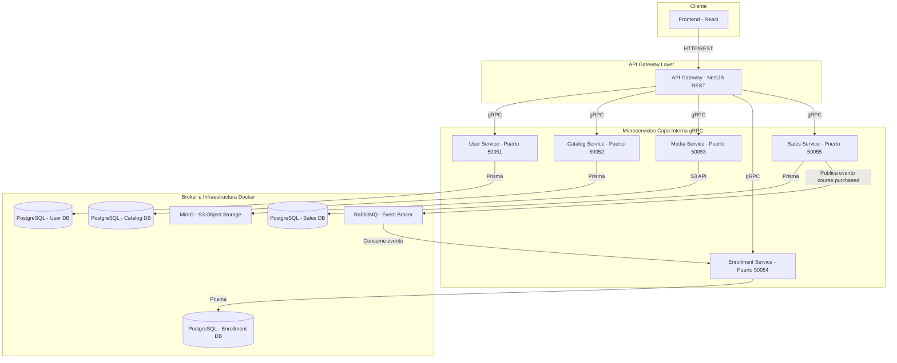

# Informe de Arquitectura

> **Hub central de la arquitectura de la plataforma Udemy Clone.**  
> Este informe describe la topología, los servicios, la comunicación, la persistencia y la infraestructura del ecosistema de microservicios.

---

## 📘 Documentos Principales

👉 **[`INFORME_DE_ARQUITECTURA.md`](./INFORME_DE_ARQUITECTURA.md)**

Contiene la descripción completa de la arquitectura: topología, responsabilidades por servicio, patrones de comunicación, persistencia, autenticación, almacenamiento de media, contratos compartidos, decisiones arquitectónicas y operación local/despliegue en nube (AWS).

---

## 🗺️ Topología General de Componentes

El ecosistema está compuesto por un API Gateway, cinco microservicios de dominio, un broker de eventos, object storage y una base de datos PostgreSQL por servicio. El detalle de cada nodo se encuentra en el [informe completo](./INFORME_DE_ARQUITECTURA.md); este diagrama sirve como mapa de orientación rápida.

---

## 🛠️ Repositorios del Ecosistema

El código del sistema se distribuye en los siguientes repositorios:

1.  [`maestria-architecture`](https://github.com/Pryectomaestria1/maestria-architecture.git): Informe de arquitectura (este repositorio).
2.  [`maestria-grpc-contracts`](https://github.com/Pryectomaestria1/maestria-grpc-contracts.git): Contratos compartidos y definiciones `.proto`.
3.  [`maestria-infra`](https://github.com/Pryectomaestria1/maestria-infra.git): Recursos de soporte local (PostgreSQL, RabbitMQ, MinIO, pgAdmin).
4.  [`maestria-api-gateway`](https://github.com/Pryectomaestria1/maestria-api-gateway.git): Puerta de enlace REST hacia la capa de microservicios.
5.  [`maestria-user-service`](https://github.com/Pryectomaestria1/maestria-user-service.git): Gestión de perfiles y roles.
6.  [`maestria-catalog-service`](https://github.com/Pryectomaestria1/maestria-catalog-service.git): Catálogo de cursos, módulos, lecciones y recursos.
7.  [`maestria-media-service`](https://github.com/Pryectomaestria1/maestria-media-service.git): URLs prefirmadas y metadatos de recursos multimedia.
8.  [`maestria-enrollment-service`](https://github.com/Pryectomaestria1/maestria-enrollment-service.git): Inscripciones y progreso de estudiantes.
9.  [`maestria-sales-service`](https://github.com/Pryectomaestria1/maestria-sales-service.git): Flujo de compra y emisión de eventos.
