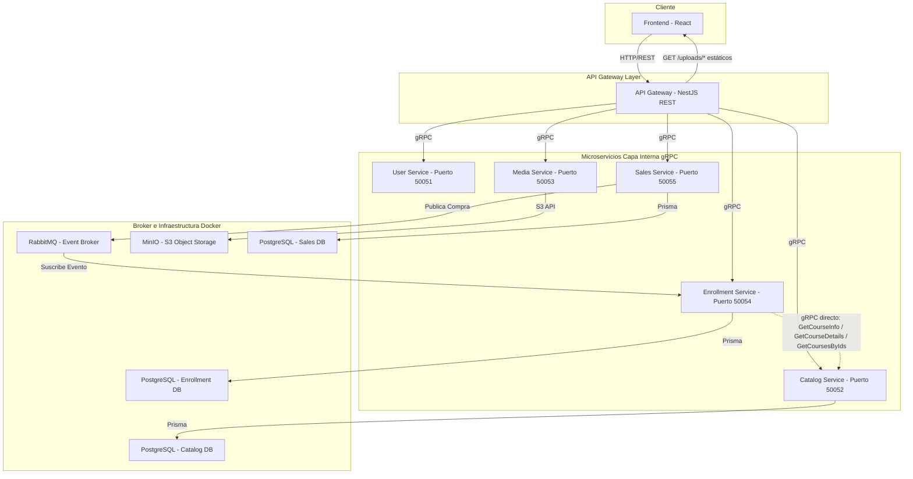

# Maestria - Hub de Arquitectura y Topología 🏛️

Este repositorio centraliza toda la documentación técnica, diagramas, topología de red y guías de diseño para el ecosistema de microservicios.

---

## 📚 Jerarquía Documental

La documentación de arquitectura se organiza en dos documentos con roles explícitos. Elige el que responde a tu pregunta antes de profundizar en cualquiera de los repos del ecosistema.

| Documento | Rol | Cuándo leerlo |
|-----------|-----|---------------|
| [`IMPLEMENTATION_STATE.md`](./IMPLEMENTATION_STATE.md) | **Estado Actual / Current State** — fuente de verdad de la realidad implementada | Primero si vas a desarrollar, debuggear, provisionar infra o entender qué corre hoy (puertos, bases, flujos, acoplamientos, brechas) |
| [`TDD_Udemy_Clone_Microservices.md`](./TDD_Udemy_Clone_Microservices.md) | **Arquitectura Objetivo / Target Architecture** — visión de diseño a la que el sistema apunta | Cuando necesites entender la dirección de arquitectura, los patrones que se busca alcanzar y el gap respecto al estado actual |

> El TDD está encabezado con `TARGET ARCHITECTURE v2` y enlaza de vuelta a `IMPLEMENTATION_STATE.md` como fuente de verdad de la realidad. Toda divergencia entre el target y el estado actual está marcada con `OBJETIVO` en el TDD y con `⚠️ DESVIACION` en `IMPLEMENTATION_STATE.md`.

---

## 🗺️ Topología General de Componentes

El ecosistema está fragmentado en componentes independientes con propósitos específicos. Para el detalle de cada nodo (puertos verificados, persistencia, flujos), consulta `IMPLEMENTATION_STATE.md`; este diagrama sirve como mapa de orientación rápida.

> **Notas de la topología:**
> - La flecha `GW → /uploads/*` refleja el estado actual: el API Gateway sirve archivos estáticos desde su propio disco (videos, portadas, recursos). En la visión objetivo (ver TDD) el Gateway es stateless y todo el material pasa por MinIO. Detalle en `IMPLEMENTATION_STATE.md` §2, §4.5 y §6.2.
> - La flecha punteada `ES -.-> CS` representa el acoplamiento directo por gRPC entre `enrollment-service` y `catalog-service` para resolver datos de curso (precio, detalle, batch). No aparece en diagramas históricos. Detalle en `IMPLEMENTATION_STATE.md` §3.4 y §6.4.
> - **Servicio de reseñas (gap):** el contrato `review.proto` está declarado en `maestria-grpc-contracts` con CRUD completo, pero **no existe** el repositorio `maestria-review-service` y el API Gateway **no registra** un cliente gRPC de reseñas. La capacidad está documentada en el TDD como `OBJETIVO` y en `IMPLEMENTATION_STATE.md` §6.5 como `Problema Conocido`.

---

## 📁 Documentos Disponibles

*   [`IMPLEMENTATION_STATE.md`](./IMPLEMENTATION_STATE.md) — **Estado Actual** (primario). Topología, puertos verificados, persistencia PostgreSQL-only, flujos reales, infraestructura, problemas conocidos.
*   [`TDD_Udemy_Clone_Microservices.md`](./TDD_Udemy_Clone_Microservices.md) — **Arquitectura Objetivo** (secundario, `TARGET ARCHITECTURE v2`). Diseño técnico, contratos gRPC, patrones event-driven y stateless, divergencias marcadas con `OBJETIVO`. La guía de migración de MinIO a AWS S3 vive dentro de este documento (sección 6.2) — no se duplica aquí.

---

## 🛠️ Estructura de Repositorios del Ecosistema

Para el desarrollo del proyecto, el código se encuentra distribuido en los siguientes repositorios:

1.  [`maestria-architecture`](https://github.com/Pryectomaestria1/maestria-architecture.git): Documentación, topología y guías de diseño (Este repositorio).
2.  [`maestria-grpc-contracts`](https://github.com/Pryectomaestria1/maestria-grpc-contracts.git): Contratos compartidos y definiciones `.proto` (Única fuente de verdad).
3.  [`maestria-infra`](https://github.com/Pryectomaestria1/maestria-infra.git): Archivo `docker-compose.yml` para levantar la base de datos, colas y almacenamiento local.
4.  [`maestria-api-gateway`](https://github.com/Pryectomaestria1/maestria-api-gateway.git): Puerta de enlace NestJS.
5.  [`maestria-user-service`](https://github.com/Pryectomaestria1/maestria-user-service.git): Gestión de perfiles y usuarios.
6.  [`maestria-catalog-service`](https://github.com/Pryectomaestria1/maestria-catalog-service.git): Catálogo de cursos.
7.  [`maestria-media-service`](https://github.com/Pryectomaestria1/maestria-media-service.git): Streaming y carga de archivos multimedia.
8.  [`maestria-enrollment-service`](https://github.com/Pryectomaestria1/maestria-enrollment-service.git): Inscripciones y seguimiento de progreso.
9.  [`maestria-sales-service`](https://github.com/Pryectomaestria1/maestria-sales-service.git): Pasarela simulada de cobros y facturación.

> **Pendiente:** `maestria-review-service` está planificado pero el repositorio aún no existe. El contrato `review.proto` se mantiene en `maestria-grpc-contracts` esperando la implementación del servicio.
