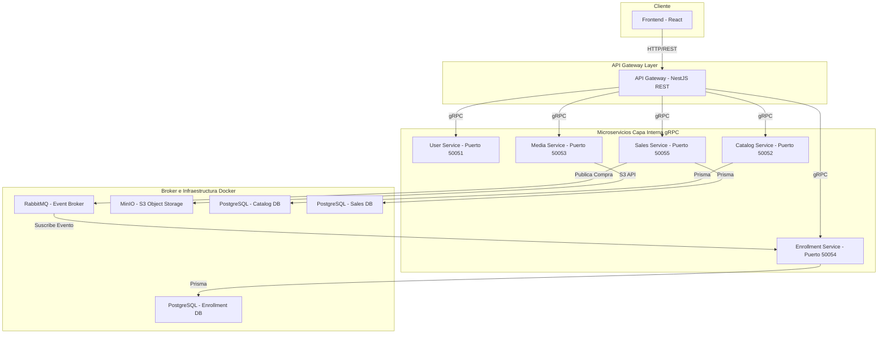

# Maestria - Hub de Arquitectura y Topología 🏛️

Este repositorio centraliza toda la documentación técnica, diagramas, topología de red y guías de diseño para el ecosistema de microservicios.

## 📁 Documentos Disponibles

*   [**Técnico de Diseño (TDD)**](file:///C:/Users/Gabo/Desktop/udemy/maestria-architecture/TDD_Udemy_Clone_Microservices.md): Documento principal que detalla el flujo de datos, diseño de bases de datos políglotas, alcance de la migración y contratos gRPC.
*   **Guía de Migración MinIO a AWS S3**: Incluida detalladamente dentro del documento técnico, explicando cómo configurar el `media-service` para conectarse a un bucket en producción.

---

## 🗺️ Topología General de Componentes

El ecosistema está fragmentado en componentes independientes con propósitos específicos:

## 🛠️ Estructura de Repositorios del Ecosistema

Para el desarrollo del proyecto, el código se encuentra distribuido en los siguientes repositorios:

1.  [`maestria-architecture`](https://github.com/Pryectomaestria1/maestria-architecture.git): Documentación, topología y guías de diseño (Este repositorio).
2.  [`maestria-grpc-contracts`](https://github.com/Pryectomaestria1/maestria-grpc-contracts.git): Contratos compartidos y definiciones `.proto` (Única fuente de verdad).
3.  [`maestria-infra`](https://github.com/Pryectomaestria1/maestria-infra.git): Archivo `docker-compose.yml` para levantar la base de datos, colas y almacenamiento local.
4.  [`maestria-api-gateway`](https://github.com/Pryectomaestria1/maestria-api-gateway.git): Puerta de enlace NestJS.
5.  [`maestria-user-service`](https://github.com/Pryectomaestria1/maestria-user-service.git): Gestión de perfiles y usuarios.
6.  [`maestria-catalog-service`](https://github.com/Pryectomaestria1/maestria-catalog-service.git): Catálogo de cursos.
7.  [`maestria-media-service`](https://github.com/Pryectomaestria1/maestria-media-service.git): Streaming y carga de archivos multimedia.
8.  [`maestria-enrollment-service`](https://github.com/Pryectomaestria1/maestria-enrollment-service.git): Inscripciones y seguimiento de progreso.
9.  [`maestria-sales-service`](https://github.com/Pryectomaestria1/maestria-sales-service.git): Pasarela simulada de cobros y facturación.
