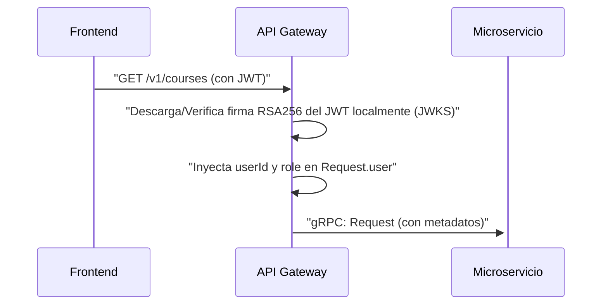
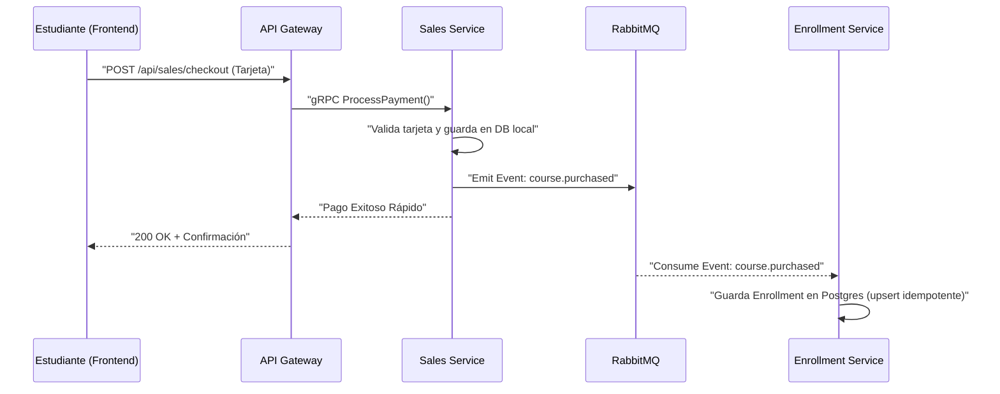
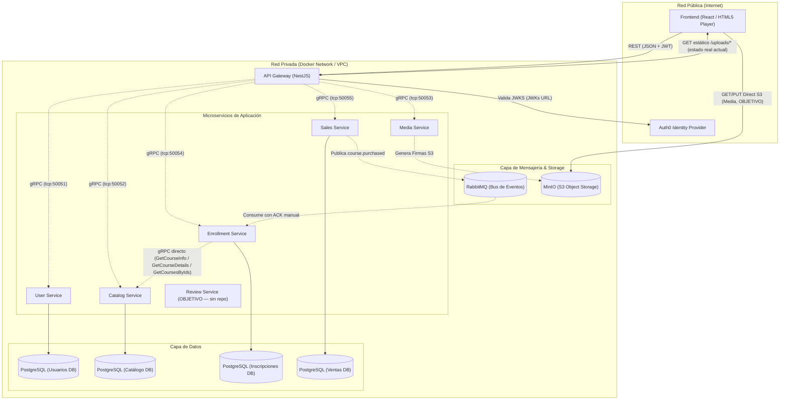

# Udemy Clone - Diseño Técnico (Migración a Microservicios)
ESTADO DEL DOCUMENTO: TARGET ARCHITECTURE v2

> **Aviso importante — Este documento describe la arquitectura OBJETIVO, no el estado actual de producción.**
>
> Para entender **qué corre hoy** en el ecosistema —puertos verificados, bases de datos operativas, flujos reales, acoplamientos directos y brechas conocidas— consulta el documento primario:
>
> → [`IMPLEMENTATION_STATE.md`](./IMPLEMENTATION_STATE.md) — **Estado Actual / Current State**, fuente de verdad de la realidad implementada.
>
> Las afirmaciones de este TDD describen la **visión de arquitectura objetivo** que el sistema busca alcanzar. Cuando un patrón objetivo difiere de la realidad actual, se etiqueta con `OBJETIVO` y se enlaza con la entrada correspondiente en la sección `Problemas Conocidos / Known Issues` de `IMPLEMENTATION_STATE.md`. Este archivo no describe lo que el sistema ejecuta en este momento.

---

## Resumen
Este proyecto es la evolución de la Plataforma de Aprendizaje en Línea Udemy Clone, migrando desde un enfoque monolítico hacia una arquitectura basada en **Microservicios**. El objetivo principal es lograr escalabilidad independiente, resiliencia y separación de dominios. Los usuarios interactúan a través de un **API Gateway** (REST), el cual se comunica internamente con un clúster de microservicios distribuidos utilizando **gRPC** para garantizar la máxima velocidad y eficiencia en la red interna.

## Supuestos
- La infraestructura permite el despliegue de múltiples servicios aislados (Docker/Kubernetes).
- `OBJETIVO` — Los archivos multimedia (videos, recursos) se manejan en una visión 100% stateless contra MinIO con URLs pre-firmadas; el flujo actual coexiste con escritura directa a disco del API Gateway. Ver §6.2 y [`IMPLEMENTATION_STATE.md` §4.5](./IMPLEMENTATION_STATE.md).
- Se utiliza Auth0 como proveedor de identidad OIDC centralizado.

## Alcance de la Migración
**La migración a Microservicios incluye:**
- Separación estricta de dominios: Autenticación, Catálogo, Inscripciones, Multimedia, Ventas (Simulación) y Reseñas (planificado, ver §2).
- Comunicación interna síncrona mediante **gRPC** y Protocol Buffers para consultas directas.
- `OBJETIVO` — Arquitectura orientada a eventos (Event-Driven) con **RabbitMQ** para procesos asíncronos (ej. Inscripciones tras compra). El flujo real de inscripción es **híbrido sync + async** (ver §4 y §6.5); el patrón puro event-driven permanece como meta.
- `OBJETIVO` — Base de datos por servicio (Database-per-service pattern) garantizando bajo acoplamiento. La realidad actual usa PostgreSQL en los cuatro servicios (ver [`IMPLEMENTATION_STATE.md` §4.1](./IMPLEMENTATION_STATE.md)).
- Simulador del flujo de compras en un servicio desacoplado.
- `OBJETIVO` — Manejo de archivos *Stateless* utilizando MinIO (S3 compatible) y URLs pre-firmadas. La realidad combina este path con escritura a disco del API Gateway (ver §6.2).

**Fuera del alcance (Fase actual):**
- Despliegue distribuido en nube pública (actualmente centralizado en `docker-compose`).
- Implementación del Patrón Transactional Outbox: Actualmente, el Sales Service hace una doble escritura (PostgreSQL + RabbitMQ). La implementación de una tabla Outbox para garantizar la entrega atómica de eventos en escenarios de caída abrupta del contenedor queda diferida para una fase posterior.
- `OBJETIVO` — Flujo de compensación `enrollment.failed → REFUNDED`: la emisión y consumo del evento compensatorio que revierte un pago cuando falla la inscripción **no se encuentra implementado** en el código actual. La sección 6.5 lo describe como visión objetivo. Ver [`IMPLEMENTATION_STATE.md` §6.1](./IMPLEMENTATION_STATE.md).
- Escalado Horizontal del API Gateway: En una fase futura, el API Gateway se replicará horizontalmente en múltiples instancias detrás de un Balanceador de Carga (como NGINX o un ALB en AWS) para mitigar el punto único de falla (SPOF) y garantizar la Alta Disponibilidad (HA). La sección §2 nota que el Gateway mantiene estado en disco (`uploads/`), lo que debe resolverse antes del escalado horizontal.
- `OBJETIVO` — Servicio de reseñas (`review-service`): el contrato `review.proto` está parcialmente implementado en `maestria-grpc-contracts` (CRUD completo), pero **no existe** el repositorio `maestria-review-service` y el API Gateway **no registra** un cliente gRPC de reseñas. Ver §2 y §3, y [`IMPLEMENTATION_STATE.md` §6.5](./IMPLEMENTATION_STATE.md).

---

## 1. Requerimientos

### 1.1 Requerimientos Funcionales
1. **API Gateway Único:** Todas las peticiones del frontend (React) deben pasar por un único punto de entrada (API Gateway), el cual enruta y orquesta la solicitud hacia el microservicio correspondiente usando gRPC.
2. **Gestión de Cursos (Catalog):** Los instructores deben poder crear cursos, módulos y lecciones (con sus respectivas descripciones), almacenados de forma relacional y estructurada.
3. **Multimedia y Streaming (Media):** Soporte para la subida de archivos de video (MP4) de manera escalable, generando URLs de subida pre-firmadas hacia un S3 (MinIO local) para que los archivos no saturen el microservicio.
4. **Carrito de Compras y Pagos (Sales):** Los estudiantes deben poder agregar cursos a un carrito persistente y simular un flujo completo de compra procesando datos de tarjeta (simulados). Al finalizar, el sistema debe emitir un evento de compra exitosa.
5. **Inscripciones y Progreso (Enrollment):** Tras concretar una compra exitosa (escuchando el evento asíncrono), el sistema debe registrar el acceso permanente a los cursos y realizar un seguimiento del progreso.
6. `OBJETIVO` — **Reseñas (Review):** Los estudiantes deben poder crear, leer, actualizar, eliminar y listar reseñas de un curso. El contrato gRPC `review.proto` ya está declarado en `maestria-grpc-contracts`; la implementación del servicio y la exposición en el API Gateway están pendientes. Ver [`IMPLEMENTATION_STATE.md` §6.5](./IMPLEMENTATION_STATE.md).

### 1.2 Requerimientos No Funcionales
1. **Baja Latencia Interna:** La comunicación entre el API Gateway y los microservicios se realiza utilizando **gRPC** (binario sobre HTTP/2) para minimizar la latencia.
2. **Aislamiento de Fallos y Asincronía:** El desacoplamiento garantiza que la falla en un dominio de negocio no detenga por completo la plataforma. La coreografía de eventos vía RabbitMQ permite resiliencia si un microservicio consumidor cae.
3. **Contratos Estrictos (Protobuf):** Todos los microservicios definen y comparten sus interfaces síncronas usando archivos `.proto` centralizados.

---

## 2. Entidades y Microservicios Principales

1. **`api-gateway` (NestJS):** Expone endpoints REST/HTTP al Frontend, realiza validaciones básicas y actúa como cliente gRPC hacia la capa de microservicios. `OBJETIVO` — En la arquitectura objetivo, el Gateway es **stateless** y no almacena archivos en su propio disco. La realidad actual mantiene estado en disco bajo `uploads/` (ver §6.2 y [`IMPLEMENTATION_STATE.md` §2 y §6.2](./IMPLEMENTATION_STATE.md)).
2. **`user-service`:** Gestiona la interacción con Auth0, mantiene perfiles de usuario y roles, y expone lectura batch para componer respuestas con datos de instructor. `OBJETIVO` — En la arquitectura objetivo, `user-service` es el punto central de interacción con el IdP; en el flujo real actual esa responsabilidad la ejerce el API Gateway mediante JWKS local (ver §6.6 y [`IMPLEMENTATION_STATE.md` §3.1](./IMPLEMENTATION_STATE.md)).
3. **`catalog-service` (PostgreSQL + Prisma):** Administra las entidades `Course`, `Module` y `Lesson` (incluyendo sus descripciones, portadas y recursos).
4. **`enrollment-service` (PostgreSQL + Prisma):** `OBJETIVO` — Escucha eventos de RabbitMQ para crear inscripciones (`Enrollment`) y administra el progreso vía gRPC. La realidad actual es **híbrida**: también recibe inscripciones síncronas desde el Gateway. Adicionalmente consume `catalog-service` directamente por gRPC para componer datos de curso (ver §6.5 y [`IMPLEMENTATION_STATE.md` §3.4 y §6.4](./IMPLEMENTATION_STATE.md)).
5. **`sales-service` (PostgreSQL + Prisma + RabbitMQ):** Controla el flujo transaccional de compra y emite el evento `course.purchased` vía message broker. `OBJETIVO` — La compensación `enrollment.failed` que revierte a `REFUNDED` no está implementada.
6. **`media-service` (AWS SDK S3):** Servicio *Stateless* que genera `Presigned URLs` contra MinIO para subidas y descargas directas del cliente al storage.
7. `OBJETIVO` — **`review-service`:** Servicio planificado para gestionar reseñas de cursos (CRUD + listado por curso). El contrato `review.proto` está declarado en `maestria-grpc-contracts` con los RPCs `CreateReview`, `GetReview`, `UpdateReview`, `DeleteReview` y `ListCourseReviews`. **El repositorio `maestria-review-service` no existe** en el workspace y el API Gateway no registra un cliente gRPC de reseñas. Cross-link: [`IMPLEMENTATION_STATE.md` §6.5](./IMPLEMENTATION_STATE.md).

---

## 3. Interfaces y Contratos (gRPC + REST)

- **Frontend -> API Gateway:** Comunicación tradicional REST (JSON). La identidad se valida en el API Gateway mediante middlewares y JWT (`Authorization: Bearer <token>`).
- **API Gateway -> Microservicios:** Protocolo **gRPC**. Esto significa que las peticiones HTTP REST se mapean a peticiones de llamadas a procedimientos remotos.

**Fragmento de Contrato gRPC (`catalog.proto`):**
> El snippet a continuación es **ilustrativo** de la forma del contrato. El `CatalogService` real declara **trece RPCs** en `maestria-grpc-contracts/catalog.proto`: `CreateCourse`, `AddModuleToCourse`, `AddLessonToModule`, `UpdateLessonVideo`, `GetCoursesByIds`, `GetCourseInfo`, `ListCourses`, `GetCourseDetails`, `UpdateCourse`, `AddResourceToLesson`, `UpdateModule`, `UpdateLesson`, `VerifyOwnership`. El `Course` real incluye `coverImage` (campo 6) y el `Lesson` real incluye `description` (campo 6), `position` (campo 7) y `resources[]` (campo 8).

```proto
syntax = "proto3";
package catalog;

service CatalogService {
  rpc CreateCourse (CreateCourseRequest) returns (Course);
  rpc UpdateModule (UpdateModuleRequest) returns (Module);
  rpc UpdateLesson (UpdateLessonRequest) returns (Lesson);
}

message CreateCourseRequest {
  string title = 1;
  string instructorId = 2;
  double price = 3;
  string description = 4;
}

message Course {
  string id = 1;
  string title = 2;
  string instructorId = 3;
  double price = 4;
  string description = 5;
  string coverImage = 6;
}

message UpdateModuleRequest {
  string moduleId = 1;
  string title = 2;
  string description = 3;
}

message Module {
  string id = 1;
  string courseId = 2;
  string title = 3;
  string description = 4;
}

message UpdateLessonRequest {
  string lessonId = 1;
  string title = 2;
  string description = 3;
}

message Lesson {
  string id = 1;
  string moduleId = 2;
  string title = 3;
  string videoUrl = 4;
  string status = 5;
  string description = 6;
  int32 position = 7;
  repeated Resource resources = 8;
}

message Resource {
  string id = 1;
  string lessonId = 2;
  string title = 3;
  string fileUrl = 4;
  string fileType = 5;
}
```

`OBJETIVO` — **`review.proto` (servicio de reseñas):** el contrato vive en `maestria-grpc-contracts/review.proto` y declara el servicio `ReviewService` con los RPCs `CreateReview`, `GetReview`, `UpdateReview`, `DeleteReview` y `ListCourseReviews`. Los tipos TypeScript están pre-generados en `generated/review.ts`. El servicio `maestria-review-service` **no existe** como repositorio y el API Gateway **no registra** un cliente gRPC de reseñas. La capacidad queda documentada como gap en [`IMPLEMENTATION_STATE.md` §6.5](./IMPLEMENTATION_STATE.md).

---

## 4. Flujo de Datos

**Flujo End-to-End de Autenticación y API Gateway:**


`OBJETIVO` — **Flujo Transaccional de Compra (Saga con RabbitMQ):**


> **Nota sobre el flujo real:** la realidad actual es un **patrón dual-write** donde el API Gateway, tras `ProcessPayment` exitoso, llama además a `EnrollStudent` por cada curso del carrito en paralelo. La inscripción puede materializarse por cualquiera de los dos caminos (síncrono Gateway→enrollment-service o asíncrono sales→RabbitMQ→enrollment-service), y la idempotencia se mantiene mediante `upsert` en el consumidor. No hay Outbox transaccional ni flujo de compensación `enrollment.failed → REFUNDED` implementado. Ver [`IMPLEMENTATION_STATE.md` §4.4 y §6.1](./IMPLEMENTATION_STATE.md).

---

## 5. Diseño de Alto Nivel de Microservicios



> **Notas del diagrama:**
> - Los puertos gRPC son los **asignados a la implementación actual** (ver [`IMPLEMENTATION_STATE.md` §1.1](./IMPLEMENTATION_STATE.md) para la fuente verificada).
> - `Review Service` aparece marcado como `OBJETIVO`: el contrato `review.proto` está declarado en `maestria-grpc-contracts`, pero el repositorio del servicio y el cliente gRPC en el API Gateway están pendientes. Ver [`IMPLEMENTATION_STATE.md` §6.5](./IMPLEMENTATION_STATE.md).
> - La flecha `AG → /uploads/*` refleja el **estado actual real** (el Gateway sirve estáticos desde su disco); en la visión objetivo esa ruta no existe porque el Gateway es stateless y todo pasa por MinIO. Ver §6.2.
> - `EnrS -.-> CatS` representa el acoplamiento directo por gRPC que `enrollment-service` mantiene con `catalog-service` para `GetCourseInfo`, `GetCourseDetails` y `GetCoursesByIds`. Ver [`IMPLEMENTATION_STATE.md` §3.4 y §6.4](./IMPLEMENTATION_STATE.md).

---

## 6. Inmersiones Profundas

### 6.1 Diseño de Base de Datos y Modelado (Prisma ORM)
En lugar de una única base de datos masiva, adoptamos **Database-per-service**:

`OBJETIVO` — La sección siguiente describe la **visión objetivo** del modelado Prisma del catálogo. La realidad operativa es PostgreSQL en los cuatro servicios y la convención de nombres de base es `*_db` (catalog_db / enrollment_db / sales_db / user_db). Ver [`IMPLEMENTATION_STATE.md` §4.1 y §5.2](./IMPLEMENTATION_STATE.md) para la divergencia de naming documentada.

**`catalog-service` (PostgreSQL)**
```prisma
model Course {
  id           String   @id @default(uuid())
  title        String
  description  String   @default("")
  instructorId String
  price        Float
  coverImage   String?
  modules      Module[]
}

model Module {
  id          String   @id @default(uuid())
  courseId    String
  title       String
  description String   @default("")
  position    Int
  course      Course   @relation(fields: [courseId], references: [id], onDelete: Cascade)
  lessons     Lesson[]
}

model Lesson {
  id          String     @id @default(uuid())
  moduleId    String
  title       String
  description String     @default("")
  videoUrl    String?
  status      String     @default("Pending")
  position    Int
  module      Module     @relation(fields: [moduleId], references: [id], onDelete: Cascade)
  resources   Resource[]
}

model Resource {
  id       String @id @default(uuid())
  lessonId String
  title    String
  fileUrl  String
  fileType String
  lesson   Lesson @relation(fields: [lessonId], references: [id], onDelete: Cascade)
}
```

**`enrollment-service` (PostgreSQL)**
```prisma
model Enrollment {
  id               String   @id @default(uuid())
  courseId         String
  userId           String
  amountPaid       Float    @default(0)
  progress         Float    @default(0)
  completedLessons String[] @default([])
  createdAt        DateTime @default(now())

  @@unique([userId, courseId])
}
```

### 6.2 Almacenamiento y Streaming de Medios (MinIO Stateless)
- **Flujo de Carga (Upload mediante URLs Pre-firmadas):** Para evitar cuellos de botella en el backend, se implementa una delegación de carga estructurada respetando que el Frontend jamás tenga visibilidad directa sobre la red interna de microservicios:
  1. **Solicitud:** El Frontend (React) solicita una URL de subida pre-firmada enviando una petición REST HTTP al **API Gateway**.
  2. **Resolución Interna:** El **API Gateway** actúa como intermediario seguro y solicita la generación de la firma al **media-service** a través de una llamada síncrona **gRPC**.
  3. **Firma:** El **media-service**, interactuando de forma stateless con el bucket S3 (MinIO) mediante `@aws-sdk/client-s3`, genera la URL pre-firmada (con tiempo limitado de expiración) y la devuelve al **API Gateway** vía gRPC.
  4. **Retorno:** El **API Gateway** retorna la URL pre-firmada final al Frontend como respuesta REST.
  5. **Carga Directa:** El Frontend realiza una petición HTTP `PUT` directamente al Object Storage (**MinIO** en desarrollo local, o S3/CDN en producción) utilizando la URL obtenida.
- `OBJETIVO` — **Regla de Oro (target):** el Frontend únicamente conoce y tiene contacto público con el **API Gateway** (para operaciones de negocio) y con **MinIO/S3** (para transferencia masiva de archivos). Los microservicios internos permanecen 100% aislados en la red interna de Docker. **Esta regla NO se cumple en la realidad actual**: el API Gateway también escribe videos, portadas y recursos a su propio `uploads/` y los sirve como estáticos bajo `/uploads/*`, lo que vuelve al Gateway **stateful por disco** y rompe la frontera limpia con MinIO. La coexistencia de los dos paths (local-disk + MinIO presigned) está documentada en [`IMPLEMENTATION_STATE.md` §4.5 y §6.3](./IMPLEMENTATION_STATE.md).
- **Ventaja Tecnológica:** Se elimina por completo el uso de memoria RAM del servidor backend y la saturación del Event Loop en Node.js durante la transferencia de archivos de video pesados (MP4).

### 6.3 Orquestación con Docker Compose
Toda la infraestructura se agrupa mediante `docker-compose.yml`, levantando:
- **Bases de datos**: PostgreSQL.
- **Herramientas**: pgAdmin.
- **Message Broker**: RabbitMQ (Management UI en 15672).
- **Object Storage**: MinIO (Console en 9001) con un script automático para crear el bucket `udemy-media`.

### 6.4 Generación de Código TypeScript desde Protos
Para brindar tipado estático estricto en el desarrollo y evitar el uso de tipados laxos (`any`), los contratos de comunicación se materializan así:

- `OBJETIVO` — **Toolchain objetivo:** la visión es usar el compilador oficial `protoc` con el plugin `ts-proto` configurado para NestJS (`nestJs=true`) y ejecutar `npm run generate` desde el directorio `grpc-contracts`. Las versiones históricamente declaradas en este documento (`protoc 25.9` + `ts-proto 2.11.8`) no son las que se usan en la práctica.
- **Realidad actual:** el repositorio `maestria-grpc-contracts` opera con un `package.json` sin dependencias declaradas; el script `npm run generate` referencia una ruta de Windows (`.cmd` con prefijo `..\\backend-microservices\\review-grpc-service\\`) que no es portable a Linux/macOS. La generación real se realiza mediante un script custom `generate-ts.js` que parsea los `.proto` y produce los tipos TypeScript. Los artefactos resultantes viven en `generated/` y **están pre-generados y versionados** en el repositorio — los servicios importan desde `generated/`, no regeneran en cada build.
- **Implicación:** el camino de regeneración no funciona out-of-the-box en entornos no-Windows. Cualquiera que necesite regenerar los tipos debe ajustar el script o invocarlo manualmente. Ver [`IMPLEMENTATION_STATE.md` §6.8](./IMPLEMENTATION_STATE.md) para el detalle del toolchain no portable.

### 6.5 Arquitectura Event-Driven (RabbitMQ)
- `OBJETIVO` — El proceso de compras dejó de ser un cuello de botella síncrono que bloquea la respuesta al cliente. La visión es que **toda** la inscripción se materialice vía consumo asíncrono del evento `course.purchased`. En la realidad actual la inscripción es híbrida: el API Gateway llama además a `EnrollStudent` por cada curso en paralelo (ver §4 y [`IMPLEMENTATION_STATE.md` §4.4](./IMPLEMENTATION_STATE.md)).
- El **Sales Service** persiste su transacción local e inmediatamente utiliza un `ClientProxy` (transporte AMQP) para despachar un evento asíncrono `course.purchased`.
- El **Enrollment Service** está configurado en un modelo de microservicio híbrido (gRPC + RabbitMQ). Al atrapar el evento con el decorador `@EventPattern('course.purchased')`, procesa y persiste asíncronamente el acceso del estudiante al curso. La operación usa `upsert` para idempotencia ante re-entregas del broker.
- **Garantía de Entrega (At-Least-Once):** la mensajería con RabbitMQ utiliza **Colas Durables (Durable Queues)** y **Acuses de Recibo Manuales (Manual ACKs)** configurando `noAck: false`. Esto asegura que si el `enrollment-service` consume el mensaje pero se apaga o sufre una caída antes de confirmar la persistencia en Postgres, RabbitMQ detectará la desconexión del canal y re-encolará (re-queue) automáticamente el evento, impidiendo cualquier pérdida de inscripciones.
- `OBJETIVO` — **Manejo de Fallos (Compensación):** la visión es que si el `Enrollment Service` falla al persistir la inscripción (ej. violación de integridad en PostgreSQL), emita un evento compensatorio `enrollment.failed`, que el `Sales Service` escucharía para revertir el estado de la transacción a `REFUNDED` y notificar al usuario, garantizando la consistencia eventual. **Esta compensación NO se encuentra implementada** en el código actual. Ver [`IMPLEMENTATION_STATE.md` §6.1](./IMPLEMENTATION_STATE.md).

### 6.6 Validación Local de Autenticación con JWKS (Stateless)
- **El Problema Original:** El API Gateway realizaba una llamada gRPC sincrónica hacia el `user-service` para verificar cada token JWT entrante, lo que sobrecargaba la red y creaba un punto único de falla acoplado para cada request HTTP.
- **La Solución Implementada:**
  1. El API Gateway utiliza `@nestjs/passport` y `jwks-rsa` para descargar y cachear de forma asíncrona la lista de llaves públicas del emisor Auth0 (`jwksUri`).
  2. La validación de la firma `RS256` y expiración del JWT ocurre 100% en memoria en el API Gateway, liberando al `user-service` de consultas recurrentes.
  3. El payload decodificado se asocia automáticamente a la petición (`request.user`), haciendo disponibles los campos `userId` y `role` para los controladores protegidos.
- **Seguridad Dinámica:** La configuración de dominio y audiencia se realiza exclusivamente mediante variables de entorno (`AUTH0_ISSUER_URL`, `AUTH0_AUDIENCE`) leídas dinámicamente con el `ConfigService` de NestJS.

### 6.7 Resolución del Problema N+1 (API Composition)
- **El Problema Original:** Al consultar la lista de cursos (`catalog-service`), el backend solo guardaba y retornaba el `instructorId` de cada curso. Para mostrar el nombre y avatar del instructor, el frontend tendría que hacer $N$ peticiones adicionales o el Gateway realizar $N$ llamadas individuales gRPC a `user-service`, provocando un problema de consultas N+1 en red.
- **La Solución Implementada (Composición en Memoria):**
  1. **Llamada de Catálogo:** El API Gateway obtiene todos los cursos en una sola petición gRPC masiva.
  2. **Consolidación de IDs:** Filtra y extrae los `instructorId`s de manera única utilizando un `Set` de JavaScript en memoria para evitar llamadas redundantes de un mismo instructor.
  3. **Lote gRPC:** Llama a un único método gRPC masivo `userService.GetUsersByIds({ userIds })` pasando el arreglo simplificado de IDs.
  4. **Unión de Datos:** Transforma la respuesta en un diccionario/hash-map en memoria (`instructorId` -> `{ name, avatarUrl }`) y compone cada curso insertándole su respectivo objeto `instructor` antes de retornar el JSON consolidado.

### 6.8 Divergencia de Nombres de Bases de Datos (cleanup futuro)
La convención operativa en uso hoy es `*_db` (catalog_db / enrollment_db / sales_db / user_db) — aprovisionadas por el init script del API Gateway y consumidas por los `.env.example` de los servicios. Existen otros sources de configuración que **no coinciden** con esa convención:

- `maestria-infra/docker-compose.yml:37` declara `POSTGRES_DB: udemy_db` (base única).
- `maestria-infra/README.md:8` referencia `udemy_catalog_db`, `udemy_enrollment_db`, `udemy_sales_db`.
- `maestria-api-gateway/docker-compose.db.yml:18` declara `POSTGRES_DB: postgres` (base de administración del contenedor; el init script provee las bases de servicio).

La reconciliación de estos sources con la convención operativa `*_db` queda como **trabajo futuro de cleanup de infra**, no como instrucción a aplicar en este cambio. La divergencia completa, con evidencia y política, está documentada en [`IMPLEMENTATION_STATE.md` §5.2 y §6.6](./IMPLEMENTATION_STATE.md).

---

## 7. Pruebas y Verificación

**Para comprobar el funcionamiento del Event-Driven y Stateless S3:**
1. **Validar Contenedores:** Asegurarse de que `docker ps` muestra a `udemy-rabbitmq` y `udemy-minio` corriendo. Los nombres concretos de contenedor y la composición utilizada hoy deben verificarse contra `maestria-infra/docker-compose.yml` antes de aplicar este checklist; ver [`IMPLEMENTATION_STATE.md` §5](./IMPLEMENTATION_STATE.md) para la descripción de la infra vigente.
2. **Dashboard RabbitMQ:** Navegar a [http://localhost:15672](http://localhost:15672) (guest/guest). Al realizar un Checkout simulado en Ventas, se podrá visualizar el tráfico entrando a la `sales_queue` e instantáneamente siendo consumido.
3. **Dashboard MinIO:** Navegar a [http://localhost:9001](http://localhost:9001) (admin/password123). Al solicitar subida de contenido se generará contenido en el bucket `udemy-media`.
4. **Logs:** Revisar la consola del `enrollment-service` que imprimirá "Event received: course.purchased" indicando el enganche exitoso del bus de eventos.

---

## 8. Interesados y Contactos
- Equipo de Desarrollo Frontend
- Equipo de Operaciones / DevOps (Despliegue distribuido de contenedores)
- Arquitecto de Software
